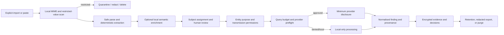

# Codename Ariadne — Privacy Model

Version: 0.3  
Date: 2026-07-14  
Status: 48-operation/46-path local candidate aggregate/package passed; production-data approval remains incomplete

## 1. Purpose and boundary

Codename Ariadne supports defensive self-audits and explicitly authorised investigations. It is local-first, has no telemetry by default, and must not turn scattered information into a needlessly dangerous dossier. Privacy applies to the primary user, authorised linked profiles, household members and associates, source authors, same-name collisions, false positives, and any third party incidentally present in imports or connector results.

This model is a product-control specification, not a claim of legal compliance or legal advice. Provider terms, jurisdiction, lawful basis, and user authority must be reviewed for each adapter and use.

## 2. Principles

1. **Purpose limitation:** collect and process only what is necessary for the declared self-audit or authorised trace.
2. **Data minimisation:** prefer metadata, hashes, masked displays, and references over duplicate bodies and plaintext values.
3. **Local by default:** extraction, normalisation, correlation, storage, search planning, and deterministic/local AI stay on device. HIBP, public search, authorised connectors, and optional OpenAI Responses are explicit external-provider boundaries.
4. **Human control:** review precedes search, transmission, attribution, impersonation classification, remediation, and external submission.
5. **Just-in-time consent:** consent is tied to a value, purpose, provider, jurisdiction, and run—not a broad one-time switch.
6. **Independent evidence dimensions:** check outcome, visibility, ownership, confidence, sensitivity, provenance, and time are stored separately.
7. **Uncertainty preservation:** failure, blockage, absence from an index, and authoritative absence are not interchangeable.
8. **Subject separation:** every datum and operation belongs to an explicit workspace/profile/run; shared accounts never imply shared identity.
9. **Reversible decisions:** corrections, exclusions, false-positive fingerprints, and attribution history remain auditable.
10. **Safe disclosure:** redacted export is the default; exact private location and hidden correlations are not exposed casually.
11. **No dark patterns:** declining a provider, connector, remote model, or retention request does not degrade local capabilities unnecessarily.
12. **Honest limits:** public-source persistence, provider retention, local compromise, screenshots, backups, and inference error cannot be eliminated completely.

## 3. Data subjects

| Subject | Typical presence | Default treatment |
|---|---|---|
| Primary authorised profile | User-supplied identity and findings | Process within explicit audit scope |
| Authorised linked profile | Separate profile or identity the user is authorised to audit | Separate workspace/profile scope and confirmation |
| Associate or household member | Relationship or incidental import mention | Minimise; do not expand or search without authority |
| Same-name or same-handle nonmatch | Search collision | Retain only a minimal exclusion fingerprint and reason |
| Source author or account owner | Public result content | Preserve only what supports provenance and review |
| Incidental third party | Mail, file, transaction, travel, health, or contact data | Quarantine/discard unless strictly necessary and authorised |

## 4. Data classification

Public availability does not make data harmless after aggregation. Classification determines the most restrictive default across storage, transmission, export, and retention.

| Class | Examples | Storage | External transmission | Export | Retention default |
|---|---|---|---|---|---|
| Public | Public name, organisation, public username, public URL | Encrypted in vault with provenance | Allowed only within selected provider policy | Included in redacted export when relevant | Audit lifetime |
| Sensitive | Email, domain, historic handle, query text, search history, source notes | Encrypted; mask in routine UI/logs | Provider-specific confirmation | Mask by default | Review at run closure |
| Highly sensitive | Full phone, exact address, date of birth, current location, recovery relationship, private connector link, personal image/biometric embedding | Encrypted; tighter UI reveal and audit events | Explicit per-run, per-provider approval; prefer masking | Excluded or coarsened by default | Shortest justified period |
| Restricted | Password, OTP, auth/reset link, card/bank data, government or identity-document number, private key/token | Quarantine only; never enter normal graph/index | Never | Never | Delete after quarantine review or immediately when safe |

Authentication credentials for durable approved connectors are operational secrets rather than identity evidence: they live only in Keychain, outside exports, search plans, logs, and the graph. Current HIBP and OpenAI API keys are narrower still: each is supplied only for one request, marked `writeOnly` in the contract, and must not be persisted in settings, the vault, logs, events, reports, or frontend storage.

Vault keys are operational secrets with an even narrower route. Rust retains Keychain custody and sends one database key over a pre-connected anonymous FD-198 socket only after exact manifest-bound authorisation. Key bytes are prohibited from argv, environment variables, bootstrap stdin, HTTP, logs, diagnostics, events, files, screenshots, webview memory, and generated contracts. Application-owned mutable buffers are cleared on failure and lock; the sidecar is replaced before a later unlock.

## 5. Independent state model

Each claim keeps these fields independently:

### Check outcome

`FOUND`, `NOT_FOUND`, `NOT_CHECKED`, `CHECK_FAILED`, `ACCESS_BLOCKED`, `AUTH_REQUIRED`, `RATE_LIMITED`, `PROVIDER_UNAVAILABLE`, `AMBIGUOUS`, `MANUAL_REVIEW_REQUIRED`, or `AUTHORITATIVE_ABSENCE` where the provider is truly authoritative.

### Visibility

- Publicly attributable.
- Public but pseudonymous.
- Privately linkable.
- Historical residue.
- Private only.
- Unknown.

### Ownership or attribution

- Confirmed match or confirmed non-match.
- Probable or possible.
- Historical ownership or current ownership.
- Account takeover or recycled username.
- Mirror/repost or unrelated collision.
- Possible or confirmed impersonation.
- Unresolved/unknown/needs more evidence.

### Confidence, sensitivity, provenance, and time

Confidence explains supporting and contradicting signals; it is not ownership. Sensitivity controls handling; it is not visibility. Provenance identifies source and transformations. Time identifies observed, valid, ownership, and decision periods. User confirmation is recorded as one provenance class and does not prove what strangers can discover.

## 6. Data lifecycle

### 6.1 Collection

- The user explicitly selects files, pastes text, or authorises a connector and scope.
- `private_reference` is never auto-ingested. Runtime import requires a file picker, purpose preview, and confirmation and does not start an audit automatically.
- Connectors retrieve account metadata first. Message or file bodies are fetched or retained only when necessary for a selected finding/evidence action.
- Broad searches that surface authentication, medical, financial, travel, purchase, current-location, or unrelated correspondence data are filtered before indexing or model use.

The implemented Phase 3 boundary accepts only an explicit paste or one browser-selected TXT, Markdown, CSV, JSON, or vCard file. Consent is required in the request. Intake files are capped at 1 MiB and checked for extension/media agreement, canonical base64, exact size, and SHA-256. Source-head Phase 5 also accepts one explicit manual evidence or already-redacted derivative file up to 10 MiB through a bounded kind-specific picker. No local path reaches Python, but both bridges place bounded raw bytes and a base64 copy in transient webview/Tauri memory. This is a deliberate development trade-off, not the final opaque native file-broker design.

### 6.2 Local preprocessing

- Validate MIME, encoding, size, nesting, and archive structure.
- Detect and quarantine restricted content before ordinary parsing, logging, preview, or AI.
- Deterministic extraction precedes semantic enrichment.
- Keep raw import retention short; preserve only explicitly selected evidence.
- Assign every entity to a profile or unresolved quarantine before correlation.

In Phase 3, restricted values are fully redacted before deterministic or semantic processing, including short, phrase, escaped, overlapping, free-text, and structured forms. Durable quarantine rows contain only a reason code and retention deadline; restricted plaintext is not stored in a normal segment, entity, graph node, model input, or API response. Normal intake is contentless by default, and expired retained temporary content is purged opportunistically. Structured parsing is isolated in a bounded spawned worker. All extracted identities and graph relationships are profile-scoped and encrypted at rest.

### 6.3 Review and purpose assignment

The target design lets the user correct, merge, split, exclude, classify, mark current/historical, set sensitivity, allow search, store only, or prohibit transmission. Implemented entity decisions record actor, time, revision, durable before/after review, sensitivity, temporal, search, and transmission policy, and a keyed opaque reason code when supplied. Human-readable free-form reason history is not yet retained. False positives keep the minimum fingerprint necessary to prevent rediscovery; unrelated dossiers are not retained.

The current Phase 3 UI implements confirm/classify/reject/exclude and sensitivity, temporal, search, and transmission policy changes. `LOCAL_ONLY` remains lossless through the API/repository mapping, while database and repository invariants prevent unsafe false-positive/excluded and highly-sensitive policies. Side effects use durable HMAC-keyed idempotency reservations/results and decision history is append-only. React retains only opaque profile/source identifiers and retry keys in a non-persistent memory store; reloading clears the active selection, but bounded vault profile listing lets the user explicitly select an existing active/draft profile again. Lock clears the memory-only selection.

### 6.4 Query planning and disclosure

Variant generation occurs locally. The planner limits variants, providers, cost, time, and sensitivity. It does not transmit all generated forms. Restricted values are structurally unrepresentable in adapter tasks.

Candidate `0006_query_policy_core` implements the first encrypted provider/plan/check/budget/approval/ledger vertical, but its catalog contains network-free local providers only. `DRY_RUN` and `MANUAL_LOCAL` manifests have no network access, identifier transmission, external flag, or processing region. Plan cells persist explicit blocked/not-checked/approval states and masked values plus keyed digests. This proves the local policy boundary; it is not permission or infrastructure for external disclosure.

Public discovery is separate from that generic planner and requires explicit self-audit authorization. Its DuckDuckGo HTML and unauthenticated GitHub-user adapters transmit only the user-entered search query, preserve honest challenge/failure states, and do not bypass access controls. Capturing a reviewed result stores the exact URL and its SHA-256 in the encrypted profile, but replaces the raw query with a purpose-keyed reference and commits the artifact/finding/neutral-assessment link atomically.

The current source also exposes official HIBP account/domain checks. Account k-anonymity avoids direct identifier transmission but still requires an eligible HIBP plan; direct account lookup sends the exact email only when both self-audit authority and separate direct-transmission authorization are true. Domain enumeration requires provider-side domain verification. API keys are ephemeral per request. Results retain official source URLs, provider attribution, request mode, state/reason, and human-review requirements; authentication, plan, verification, rate-limit, block, timeout, and provider failure remain distinct from `NO_RESULTS`.

The deterministic multi-identifier investigation planner does not execute provider work. It hashes and references bounded inputs, orders exact supported routes, labels transmission classes, and exposes unmet prerequisites such as self-audit authority, an HIBP key, k-anonymity plan access, direct-identifier authorization, or provider-verified domain ownership. Fixed manual portals are user-opened references, not automated scraping or access-control bypass. The local advanced query composer makes the complete query visible before a user opens Google, Bing, DuckDuckGo, Brave, Ecosia, Startpage, or Mojeek. Structured fields and optional raw provider-specific operators remain local until that gesture; handoff leaves Ariadne's retention boundary, performs no scraping, and imports no result or evidence automatically.

Before sensitive/highly-sensitive disclosure, the application shows:

- Value or masked value and generated variant.
- Purpose and originating entity.
- Provider and adapter.
- Operator country and hosting regions.
- Access basis and authentication scope.
- Retention knowledge, terms/privacy links, risk, expected cost, and duration.
- Whether the result returns to the same encrypted workspace.

Approval is specific to that run/provider/payload. A global “worldwide” selection still does not override highly-sensitive approval or restricted-value denial.

### 6.5 Findings, evidence, and correlation

- Raw results are retained only as long as needed to normalise and preserve selected evidence.
- Every finding identifies source, query, provider, time, transformations, and check outcome.
- Correlation shows positive signals, contradictions, missing evidence, and visibility; it cannot silently merge identities.
- Evidence originals are immutable and encrypted inside the SQLCipher vault; redaction produces a separate immutable derivative. The current bounded store does not yet provide the broader independently encrypted streaming object format.
- Archived evidence is labelled separately from current live content.

At `0007_phase5_evidence_attribution`, bounded evidence content, metadata, derivatives, findings, assessments, signals, missing evidence, and human decisions are durable and profile-scoped inside the SQLCipher vault. One content-deduplicated original may link to multiple findings in the same profile; cross-profile linking is structurally rejected. Originals are reconstructed through SHA-256 validation, every Phase 5 row is immutable, and new human decisions append a revision/supersession chain rather than overwriting history.

The authenticated API/Rust/native Findings path returns bounded metadata, an explainable versioned integer score, positive signals, contradictions, missing/next evidence, integrity state, and an optional latest human decision. It never returns stored evidence bytes and never assigns a human state from a score. Packaged `0008` adds bounded manual-local import, caller-confirmed redacted-derivative creation, and append-only human-decision mutation. It validates the declared local kind/picker media, size, and canonical base64 but does not yet sniff file signatures; originals and derivatives stay immutable/sealed, derivative input requires explicit confirmation that bytes are already redacted, and expected prior decision identity/revision prevents silent overwrite. Newer source lets an empty profile create one bounded manual finding and a neutral score-zero initial assessment atomically. The server supplies its UUID/time, all evidence remains missing, human review remains mandatory, and no evidence, decision, attribution conclusion, or network action is created.

At `0008_phase6_audit_remediation`, audit snapshots, finding fingerprints, provider coverage, remediation revisions, linked findings/evidence, provider-response records, and history are durable and profile-scoped inside SQLCipher. A selected nonadjacent comparison loads the complete persisted interval through the current run, preserving intervening lifecycle observations and NOT_CHECKED/BLOCKED coverage so an unknown absence cannot silently become removal. Replayed rows are checked against canonical payload hashes and cross-profile references fail closed. Newer source adds a user-triggered local checkpoint that automatically projects bounded, contentless Phase 5 state plus explicit coverage into these existing tables. Its fingerprint covers finding/evidence-derivative hashes and assessment/decision state; the server allocates monotonic sequence/time and a UUID. This invokes no provider, adapter, scheduler, background worker, or network.

Remediation mutations remain local records only. Create, draft, require-approval, status, deadline, evidence-link, provider-response, and reappearance operations require an unlocked exact profile; updates use revision CAS and append immutable complete revisions/history. External/legal actions remain draft or explicit-approval-required. There is no send, submit, dispatch, provider-contact, or legal-advice operation. Exact public-URL capture and broad source traversal are implemented; operational assessment recalculation, retention/purge, broader adapter-driven finding/snapshot ingestion, and evidence viewing remain unavailable.

### 6.6 Export, backup, and deletion

- The current local report route makes redaction the default. It deterministically remaps opaque identifiers and URLs and replaces profile/provider/finding/remediation/metadata text. Full-explicit output requires a fresh canonical approval UUID bound into that request, artifact, and manifest.
- Current reports are canonical JSON or inert Markdown only. They exclude evidence bytes and imported active content and are returned in memory; the core does not write a file, choose a destination, use the network, or perform an outbound action.
- The Reports UI can preview, copy, or create a browser Blob download. That saved copy is user-controlled and outside Ariadne's durable retention/deletion tracking. The approval, report, manifest, and artifact are not database records and have no durable expiry or invalidation yet.
- CSV/HTML/PDF generation and their formula/active-content hardening remain target work, not current capabilities.
- Backup bundles are encrypted and destination-aware; the UI warns about common cloud-synchronised paths.
- Purge previews dependent entities, evidence, graph edges, decisions, backups, and connector tokens.
- Cryptographic erasure by per-vault key deletion is preferred. The application does not claim guaranteed physical overwrite on APFS, SSD wear-levelling, snapshots, or third-party backups.

## 7. Provider and jurisdiction policy

### Modes

- **Local only** — default; no identifier leaves the device.
- **EU only** — only approved providers whose declared processing matches the policy.
- **Worldwide** — eligible providers globally, still subject to sensitivity and per-provider approval.
- **Custom** — explicit allowlist and blocklist.

Provider records include operator, hosting, source type, access basis, required auth, identifiers transmitted, retention, privacy/terms, removal process, payment status, risk, and default state. Unknown retention produces a visible warning. People-search and data-broker providers remain disabled by default, never bypass paywalls or create false accounts, and their claims receive lower initial confidence.

### Transmission ledger

The ledger records workspace/entity reference, masked display, keyed local digest where useful, provider, jurisdiction, timestamp, purpose, policy/approval, payload class, and result. It avoids duplicating full plaintext unless indispensable for reproducibility. The ledger is encrypted and itself classified as sensitive.

## 8. Local and remote AI

- No-LLM mode is a supported product mode, not a degraded fallback.
- Deterministic evidence remains distinct from AI inference.
- Local models are optional, versioned, benchmarked, and given only the minimum necessary text or image crop.
- Persisted local-model inputs, outputs, embeddings, and caches are encrypted and scoped to a workspace. Current corpus/workspace AI does not persist raw per-request input/output; external-provider processing remains subject to that provider's policy.
- Face detection/comparison is limited to the user's supplied images and authorised comparison set.
- Remote AI is disabled by default. Enabling a provider does not approve a payload; every sensitive payload receives a preview and explicit approval.
- Models cannot invoke adapters, change transmission policy, attribute a person conclusively, send a report, or delete/correct external content.

Phase 3 semantic enrichment is not an LLM: it is a bounded, versioned local rule set. It defaults extracted semantic entities to sensitive/private treatment, requires attributable same-sentence relation evidence, excludes negated relationships, and can be disabled without losing deterministic extraction. It makes no provider or model transmission.

The selectable AI vertical is implemented, disabled by default, and never required for deterministic operation. Loopback Ollama, LM Studio, and other explicitly configured OpenAI-compatible local runtimes do not discover LAN services, follow redirects off loopback, or fall back to cloud. Optional OpenAI Responses is a separate external-provider choice: the user supplies a key for that request and an explicit arbitrary model ID, the request sets `store: false`, and strict structured output is validated before citations are remapped to the bounded local source catalog. `store: false` reduces provider retention but is not a promise of no provider-side processing or logging. No real paid-key live test is claimed.

Intake receives restricted-value-redacted text. Corpus and workspace reasoning use bounded projections and return exact source citations, input/projection hashes, model provenance, limitations, and fallback state without persisting the per-request key or raw prompt/result. All model output is review-only and cannot become evidence or attribution by assertion.

Font scale values (90%, 100%, 110%, 125%, and 140%) and Auto/Laptop/Standard/Ultrawide display presets are presentation-only preferences stored in the local webview under `ariadne.display-preferences.v1`. They contain no workspace or identity data and invalid stored values fall back to safe defaults.

## 9. Evidence, visual output, and screenshots

- Evidence captures include source, UTC time, method, viewport, redirect chain, HTTP metadata where available, query, provider, hashes, and encryption state.
- Hashes establish post-capture integrity, not authenticity or truth.
- Private addresses appear coarsely by default; exact coordinates are not used in product screenshots.
- Development and test screenshots use only synthetic data, `.invalid` email domains, fictional organisations/places, and invented URLs/IDs.
- Visual tests scan text/metadata, and the privacy gate can OCR screenshots before packaging or sharing.
- macOS screenshots, screen recordings, and shoulder surfing remain residual user-controlled risks; reveal controls and auto-lock reduce exposure.

## 10. Retention defaults

Retention is configurable per workspace and class, with shorter defaults for more intrusive data:

| Data | Baseline policy |
|---|---|
| Restricted quarantine | Descriptor-only in Phase 3; no restricted blob is retained. A future encrypted blob workflow must verify deletion separately |
| Temporary parse/browser material | Release paste/file buffers after submission or lock. Normal source persistence is contentless by default; opportunistically purge any expired retained temporary content. If later workers create files, delete on success and clean on next start after crash |
| Idempotency results | Replay completed results for 24 hours; treat interrupted reservations as ambiguous for at most 60 seconds |
| Raw connector bodies/results | Do not retain by default; preserve only selected evidence |
| Search plans and transmission ledger | Retain for reproducibility while the run/workspace exists |
| Findings and decisions | Retain until workspace purge or configured expiry |
| Evidence originals | Durable immutable bounded content inside the SQLCipher vault at `0007`; retention/purge controls are not exposed yet, so the current milestone retains records until a later dependency-aware purge workflow exists |
| Audit snapshots and remediation history | Durable immutable profile-scoped records at current packaged `0008`; a user gesture can create a local checkpoint, but scheduled/provider ingestion and selective retention/purge are not exposed |
| Local report artifacts | JSON/Markdown returned in memory; a UI Blob save/copy is user-controlled and is not registered, expired, invalidated, or purged by the app |
| Logs | Short rolling retention, structured and redacted |
| Encrypted backups | User-defined expiry with restore status and deletion reminders |
| Local model caches | Shared public weights may persist; private prompts/embeddings follow workspace retention |

Deletion must account for derived variants, indexes, caches, evidence, exports under app control, backups, and keys. Provider-side and already-shared copies are reported as outside direct control.

## 11. User controls and rights in the product

The user can:

- Inspect provenance, transformations, confidence, contradictions, and all current values.
- Correct, split, merge, exclude, classify, and annotate entities and relationships.
- Restrict storage, search, provider transmission, AI use, export, and retention per entity.
- See and revoke connector scopes and tokens.
- See the transmission and decision history.
- Generate full or redacted exports and preview the difference.
- Purge a run/workspace and test backup/key deletion consequences.
- Mark false positives and confirmed nonmatches without retaining unrelated content.
- Disable motion, external providers, connectors, and all AI.

Irreversible or externally visible actions require a dedicated confirmation containing target, payload, consequences, and whether the action can be undone.

## 12. Telemetry, diagnostics, and support

There is no analytics, behavioural telemetry, third-party crash reporting, network font, or remote feature-flag service by default. Local structured logs use allowlisted fields and redaction; sensitive values are not accepted as log parameters.

A support bundle is opt-in, generated locally, redacted, and shown in a file-by-file preview before the user shares it. It excludes vaults, evidence, tokens, imports, queries, transmissions, screenshots, and private paths unless the user deliberately adds a redacted artifact.

## 13. Development and repository privacy

- Confidential references remain ignored and preferably outside the worktree for long-term use.
- The tracked scanner rejects any `private_reference` path, known private filename pattern, non-`.invalid` fixture/demo email, likely secret, and sensitive generated artifact.
- A local ignored `0600` denylist/fingerprint source may be derived at runtime from confidential files; it is compared in memory and never prints the matched value.
- CI runs generic privacy and secret rules; release scripts repeat the path/content denylist because `.gitignore` is not a packaging boundary.
- Fixtures originate only in `packages/synthetic-data` and use reserved domains and invented data.
- If confidential data ever enters Git history, sharing stops, history is purged before any push, and exposed tokens/credentials are treated as compromised; deleting the current file is insufficient.

## 14. Verification

Privacy is tested through:

- Unit tests for classification, quarantine, redaction, masking, provider policy, variant budgets, ledger minimisation, and export rules.
- Integration tests proving restricted data never reaches adapter, log, model, screenshot, or report boundaries.
- Cross-profile, cache, browser-context, and export isolation tests.
- Connector metadata-first and body-retention tests.
- Log and support-bundle scans.
- Synthetic key-canary scans plus frame mutation, timeout, publish-order, lock/restart, fixed-descriptor, frozen-sidecar, and packaged zero-TCP tests.
- Full/redacted export snapshots and CSV formula tests.
- Screenshot text/OCR and metadata scans across all visual artifacts.
- Tracked/staged/history/package privacy scans.
- Backup/restore, retention expiry, purge, connector revocation, and crypto-erasure tests.
- Copy review that rejects guarantees of completeness, absence, anonymity, erasure, or perfect security.

The verified Phase 3 aggregate covers parser isolation, malicious structures, restricted-value handling, contentless defaults, keyed fingerprints, provenance, graph suppression, durable idempotency/replay, decision-policy invariants, and cross-profile rejection through `0005_graph_edge_origins`. Its historical privacy scans passed. Graph/local-AI/query and the `0007` durable Phase 5 read milestone retain their separately identified evidence. The 37-, 40-, and 45-operation `0008` packages retain their own aggregate and lifecycle identities. The current 48-operation local candidate passes its complete aggregate, a **425-candidate privacy scan**, frozen/staged workflows, ad-hoc packaged normal/abrupt lifecycle, and targeted browser gate under `5ca6b790…` staged, `4ba7fd0…` packaged-sidecar, and `ca68fdd4…` desktop identities. No historical artifact identity is relabelled. These local results do not approve production data: retention/purge, authorised connectors, external-provider governance, production signing/notarisation, and clean-machine validation remain incomplete.

## 15. Residual privacy risks

- Correlation and aggregation can make public facts substantially more sensitive.
- A compromised or unlocked local account can expose displayed or in-memory data.
- The current intake and Phase 5 selected-file bridges transiently expose bounded raw bytes and base64 in webview/Tauri memory (up to 1 MiB and 10 MiB respectively); path privacy is improved, but an opaque native broker would reduce this exposure.
- The isolated parser has bounded resources and network denial, but it is not a complete macOS sandbox against every file readable by the same user account.
- A completed result replays for 24 hours; an interrupted reservation can remain ambiguous for 60 seconds, and memory-only UI retry keys do not survive reload.
- Human-readable free-form decision reason history is deferred; the durable record stores only a keyed opaque reason code.
- Memory-only UI scope IDs improve minimisation but do not preserve the active selection. After reload, the user must reselect an existing active/draft profile from the bounded native profile list; lock also requires later reselection.
- Phase 5 retention and dependency-aware purge controls are not exposed, so durable evidence cannot yet be selectively expired through the product even though it remains encrypted and profile-scoped.
- Phase 6 snapshots and remediation history are retained without a product-level expiry/purge workflow. A user can now trigger automatic local checkpoint materialisation, but no adapter, scheduler, background capture, or provider-driven ingestion does so.
- A full-explicit report can contain sensitive persisted text. Its UUID proves only explicit request binding, not durable consent, expiry, recipient control, or secure destination; copied/saved Blob output can outlive the vault and app retention controls.
- Approved providers can retain or misuse queries outside the application's control.
- HIBP direct mode discloses an exact email to HIBP, and OpenAI Responses discloses the selected bounded projection to OpenAI; per-request credentials and `store: false` do not eliminate provider-side or network risk.
- Public records, mirrors, archives, caches, and third-party screenshots can persist after removal.
- Backups, APFS snapshots, cloud sync, screen capture, and endpoint tooling may retain copies.
- Models and human reviewers can infer incorrectly.
- A user can export or deliberately modify the software in unsafe ways.

The product must communicate these risks without presenting “local-first,” encryption, an empty search result, account deactivation, or a removal request as a guarantee of privacy.
