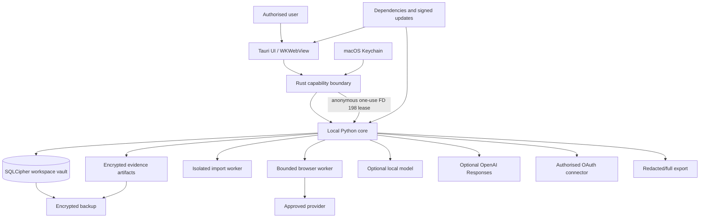

# Codename Ariadne — Threat Model

Version: 0.3  
Date: 2026-07-14  
Status: 48-operation/46-path local candidate aggregate/package passed; production boundary remains incomplete

## 1. Purpose and scope

This model covers the macOS desktop application, Tauri shell, local Python service, encrypted SQLite vault, evidence storage, import and browser workers, optional local and OpenAI Responses models, external provider adapters, authorised OAuth connectors, exports, backups, build pipeline, and update path.

It protects a defensive self-audit performed by an authorised user. It does not promise safety on a fully compromised operating system, prevent a determined user from modifying open local software for abuse, guarantee third-party deletion, or prove the truth of hostile source content. Those limitations must remain visible.

## 2. Security objectives

1. Confidential identity, evidence, connector, query, transmission, and decision data is unavailable at rest without vault keys.
2. Restricted values never reach logs, models, prompts, search plans, adapters, reports, screenshots, or exports.
3. The webview cannot directly read arbitrary local files, invoke unapproved capabilities, or contact providers.
4. Every external disclosure is policy-checked, previewed when sensitive, approved, and recorded.
5. Imports and webpages remain untrusted data; they cannot issue instructions or gain application privileges.
6. Profiles, runs, caches, jobs, evidence, and exports cannot cross-contaminate.
7. Evidence originals are immutable and verifiable; provenance and contradictions survive normalisation.
8. Failures, blocks, and uncertainty cannot be converted into false absence or identity claims.
9. No remediation, accusation, legal request, or irreversible external action occurs without explicit user approval.
10. Confidential reference material and runtime data cannot enter Git, packages, screenshots, or diagnostics through normal workflows.

## 3. System and data flows

Packaged IPC uses a `0600` Unix-domain socket behind typed Tauri commands and a payload-free event relay. Development-only loopback IPC binds to `127.0.0.1` on a random port with a per-launch token, strict Origin validation, authenticated bounded event replay, and no permissive CORS.

## 4. Assets

- Identity seeds, entities, variants, subject assignments, exclusions, and graph relationships.
- Recovery links and other private correlations that can collapse pseudonymous identities.
- Raw imports, connector metadata, message/file excerpts, and quarantined restricted values.
- Findings, source URLs, search plans, query history, coverage status, and transmission ledger.
- Evidence originals, redacted derivatives, capture metadata, hashes, and manifests.
- Attribution, impersonation, and remediation decisions and their audit histories.
- OAuth tokens, API credentials, vault keys, wrapping keys, and signing keys.
- Logs, diagnostics, crash bundles, clipboard content, temporary files, indexes, and thumbnails.
- User settings, provider policies, costs, notes, tags, local model inputs, embeddings, and model metadata.
- Application binaries, dependency lockfiles, build provenance, installers, and update metadata.

The consolidated graph and transmission/query history are high-value sensitive assets even when their individual facts are public.

## 5. Trust boundaries

| Boundary | Trusted side | Untrusted or less-trusted side | Required control |
|---|---|---|---|
| User ↔ application | Explicit interaction | Shoulder surfing, accidental action | Clear previews, lock, confirmation, safe defaults |
| Webview ↔ Rust | Reviewed commands | Compromised frontend/XSS and selected raw file bytes | Minimal Tauri capabilities, typed validation, CSP, 1 MiB file cap, exact size/hash validation |
| Rust ↔ Python | Local signed processes | Local port/socket callers | Authenticated UDS/API contracts plus nonce/manifest-bound anonymous key lease at inherited FD 198 |
| Core ↔ storage | Domain service | Filesystem, backups, sync tools | Authenticated encryption, Keychain, atomic writes |
| Core ↔ import worker | Policy engine | Hostile files/archives | Isolation, MIME/size/depth validation, quotas |
| Core ↔ browser worker | Policy engine | Hostile HTML, scripts, downloads | Isolated contexts, no privileged bridge, safe capture |
| Adapter ↔ provider | Approved payload | Foreign jurisdiction and retention | Policy preflight, TLS, allowlist, ledger |
| Core ↔ remote model | Approved bounded projection | External processing, retention, model error | Explicit provider/model, ephemeral key, `store: false`, strict schema/citation validation |
| Connector ↔ account | Minimum read scope | Overbroad account data | PKCE, scope display, metadata-first collection |
| Evidence ↔ renderer | Sanitised representation | Active HTML/PDF/content | Never execute originals; sandboxed preview |
| Export/backup ↔ outside app | Encrypted or reviewed bundle | Cloud sync, recipient, metadata | Default redaction, encryption, preview, expiry |
| Source/build ↔ release | Reviewed locked inputs | Dependency/update compromise | Lockfiles, audits, SBOM, signatures, notarisation |
| Git ↔ working tree | Tracked synthetic source | Confidential refs/runtime artifacts | Path denylist, scanner, CI, package denylist |

## 6. Threat actors and misuse cases

- A thief with a powered-off or locked laptop.
- Malware or another process running as the same local user.
- A person with temporary access to an unlocked session.
- A malicious webpage, redirect, download, archive, document, or CSV formula.
- A compromised provider, OAuth application, dependency, build runner, release key, or updater.
- An unauthorised investigator, stalker, abusive partner, insider, or malicious fork operator.
- An accidental collaborator who stages, shares, exports, or synchronises confidential material.
- A misleading public source, recycled identifier, impersonator, or poisoned search result.
- A resource-exhaustion source designed to consume requests, disk, CPU, memory, or paid quota.

## 7. Risk method

Likelihood and impact are rated Low, Medium, High, or Critical for the local-first personal deployment. Priority follows the higher dimension, adjusted upward where a single failure could expose the consolidated graph, restricted content, or cause reputational harm. Each threat has a control owner and an objective verification requirement. Residual risk is accepted only when documented in `KNOWN_LIMITATIONS.md`.

## 8. Threat register

### T01 — Stolen device and offline extraction

- Risk: High likelihood / Critical impact.
- Attack: Copy the database, WAL/temp files, evidence, backups, or exports from a lost Mac or external drive.
- Controls: FileVault baseline; SQLCipher; per-artifact authenticated encryption; per-vault key wrapped by Keychain; auto-lock and re-authentication; encrypted backups; opaque UUID paths; no plaintext indexes; private file modes.
- Verification: locked-vault filesystem inspection, WAL/temp scan, backup restore test, missing-Keychain-key failure test, deterministic idle/focus policy, delayed-Keychain system-lock cancellation, and physical sleep/wake validation before production use.
- Residual: data visible in an already unlocked session or compromised user account.

### T02 — Malicious local process or memory access

- Risk: Medium / Critical.
- Attack: Same-user malware reads memory, Keychain, clipboard, screenshots, IPC, or unlocked files.
- Controls: hardened runtime and sandbox where compatible; least privilege; one-use key channel; mutable key buffers; no keys in argv, environment, HTTP, logs, or webview; restart on lock; no automatic clipboard copy; signed/notarised binaries.
- Verification: process arguments/environment/HTTP scan, FD-198 inheritance and CLOEXEC tests, exact frame/binding mutation tests, post-Keychain pre-`GRANT` revocation, publish/lock zeroisation tests, Keychain access review, and entitlement audit.
- Residual: same-user or root compromise cannot be fully defeated by an application.

### T03 — Unauthorised local API, CSRF, or WebSocket hijack

- Risk: Medium / High.
- Attack: A browser tab or local process calls the core service.
- Controls: packaged Unix socket mode `0600` behind route-specific Rust commands; development random loopback port; per-launch bearer; strict Origin/Host checks; replay rejection; no generic proxy, LAN binding, or TCP fallback.
- Verification: cross-origin, missing/expired-token, LAN-interface, replay, and malformed-event tests.
- Residual: a process with the user's privileges may steal a live token from memory.

### T04 — OAuth token theft or excessive scope

- Risk: Medium / Critical.
- Attack: Tokens leak through logs/storage or a connector reads more account data than required.
- Controls: OAuth PKCE; minimum read-only scopes; Keychain storage; per-connector token isolation; no token export/logging; clear scope and revocation UI; short lifetimes where supported.
- Verification: scope contract tests, token string scans, revocation test, connector isolation test.
- Residual: provider-side compromise or scope semantics changing without notice.

### T05 — Provider overcollection and cross-border disclosure

- Risk: High / High.
- Attack: A provider retains or repurposes identifiers, variants, or query intent.
- Controls: local-only default; EU/world/custom modes; sensitive preflight showing exact/masked payload, purpose, jurisdiction, retention and cost; per-run approval; broker adapters off; restricted-value invariant; minimised ledger.
- Verification: policy matrix and adapter-boundary tests prove denied payloads never leave the process.
- Residual: approved providers may retain data contrary to policy statements.

### T06 — Malicious import, archive, or parser exploit

- Risk: High / High.
- Attack: Polyglot file, decompression bomb, path traversal, macro/script, XXE, oversized input, or parser vulnerability.
- Controls: exact extension/media allowlist for TXT, Markdown, CSV, JSON, and vCard; 1 MiB byte cap; canonical base64 plus exact size/SHA-256; UTF-8 and filename controls; row/cell/nesting/numeric-output limits; archive/PDF/OLE/active-content rejection; CSV formula and unsafe-vCard rejection; spawned worker with CPU/memory/time/file-descriptor/IPC bounds and network denial; parent-side restricted gate.
- Verification: synthetic malicious corpus covers archive/OLE/PDF signatures, active content, CSV formula cells, malformed/oversized/deep JSON, numeric expansion, unsafe vCard, MIME mismatch, bidi/control filenames, timeouts, crashes, and oversized IPC/results.
- Residual: zero-day parser flaws; the present browser-mediated intake and Phase 5 evidence flows transiently copy bounded raw bytes/base64 (up to 1 MiB and 10 MiB respectively) through webview/Tauri memory instead of using an opaque native broker handle. Stored HTML/PDF evidence is not rendered or parsed by the privileged UI, but later viewing needs its own hostile-content boundary. The worker is not a complete macOS sandbox against every file readable by the same user account.

### T07 — Web prompt injection, active content, or XSS

- Risk: High / High.
- Attack: Page text tells an AI or renderer to exfiltrate data, or active HTML executes in the app.
- Controls: webpage content is always data; typed extraction; originals never rendered active; sanitised/plaintext views; strict CSP; isolated Playwright contexts; no privileged browser bridge; LLM cannot call adapters or change policy.
- Verification: prompt-injection corpus, script/event-handler/SVG sanitisation tests, CSP audit.
- Residual: misleading content may still influence a human reviewer.

### T08 — SSRF, unsafe schemes, redirects, or DNS rebinding

- Risk: Medium / High.
- Attack: URL inspection reaches local services, files, metadata endpoints, or disallowed networks.
- Controls: allow HTTP(S) only; deny `file:`, `data:`, `javascript:`, browser-internal schemes, credentials-in-URL, loopback, private, link-local, multicast, and metadata ranges; resolve and re-evaluate every redirect; DNS pinning/recheck; response limits.
- Verification: IPv4/IPv6, encoded address, redirect chain, DNS-rebinding simulation, and scheme tests.
- Residual: provider-controlled public hosts can proxy internal content.

### T09 — Evidence or database tampering and corruption

- Risk: Medium / Critical.
- Attack: Modify, replace, truncate, or corrupt an artifact, manifest, or decision history.
- Controls: immutable originals; authenticated encryption; plaintext and ciphertext hashes; optional keyed manifest signature; atomic writes; foreign keys; migrations; integrity checks; encrypted backup/restore; append-only audit events.
- Verification: `0007` encrypted-repository tests reconstruct immutable originals through SHA-256 validation, reject cross-profile links, enforce content deduplication and immutable-row triggers, and bind attribution signals only to evidence linked to the same finding. Packaged `0008` tests additionally verify canonical payload hashes on persisted audit/remediation replay, immutable Phase 6 rows, complete revision/history continuity, stale-revision rejection, and cross-profile finding/evidence rejection. Newer source tests bind checkpoint fingerprints to contentless evidence/derivative and assessment/decision state, and bind report bytes to exact SHA-256/size/media descriptors while failing closed on bounds. Independent evidence-object authentication, mutation crash recovery, retention/purge, and full restore tests remain release gates.
- Residual: a hash proves preservation after capture, not that a source was truthful at capture time.

### T10 — Git, log, screenshot, export, or cloud-sync leakage

- Risk: High / Critical.
- Attack: Confidential references, PII, evidence, tokens, or correlated data enter source history or shared artifacts.
- Controls: ignore and package denylists; staged/path/history scanner; generic PII/secret detection plus ignored local in-memory fingerprints; synthetic `.invalid` fixtures; redacted structured logs; screenshot OCR/metadata scan; default-redacted exports; encrypted bundles; telemetry off; synced-path warning.
- Verification: `make privacy-check`, forced-add tests, release-content scan, log scan, screenshot OCR, and report redaction/full-explicit tests. Source report tests prove that redacted output omits seeded sensitive text, URLs, opaque IDs, and evidence bytes; full-explicit output remains approval-bound and still excludes evidence bytes. Destination/retention tracking and broader export-format snapshots remain pending.
- Residual: `git add -f`, `--no-verify`, or manual copying requires CI/release gates and user discipline.

### T11 — Supply-chain, build, or update compromise

- Risk: Medium / Critical.
- Attack: Malicious dependency, build script, package registry, CI runner, installer, or update.
- Controls: minimal dependencies; lockfiles/hashes; npm/Cargo/Python audits; SBOM; provenance; protected signing keys; signed nested binaries; hardened runtime; notarisation; signed update manifest; update feature off until verified.
- Verification: dependency audit, reproducible-build comparison where practical, signature/notarisation validation, update rejection tests.
- Residual: trusted upstream or developer-machine compromise.

### T12 — Cross-profile, run, or cache contamination

- Risk: Medium / Critical.
- Attack: Findings, queries, cookies, exclusions, evidence, or exports from one subject appear in another.
- Controls: mandatory workspace/profile/run IDs on every row, blob path, job, cache, browser context, and export; foreign keys; per-workspace vault keys; no global result cache containing identities. Phase 3, `0007`, and `0008` use composite vault/profile foreign keys; deduplication and audit/remediation timelines are profile-local.
- Verification: Phase 3 database, repository, service, and API negative tests reject cross-profile sources, origins, entities, decisions, nodes, and edges. `0007` tests additionally reject cross-profile findings, original/derivative links, assessments, signal evidence, and decisions. `0008` tests reject cross-profile audit runs, remediation findings, and evidence links at repository and API boundaries. Newer reporting projection tests reject cross-profile/nonexistent run selection. Browser Blob destination tracking and isolation for future persisted reports remain gates.
- Residual: implementation errors in new adapters require continuing contract tests.

### T13 — False attribution and reputational harm

- Risk: High / Critical.
- Attack: Same-name/username collision, stale data, hostile result, or score is presented as ownership or impersonation.
- Controls: independent status/visibility/ownership/confidence/sensitivity/provenance/time dimensions; corroboration; negative evidence and chronology; explainable scoring; cautious labels; immutable decisions; mandatory human review; no automatic accusation/submission.
- Verification: `0007` persists closed positive/negative signals, versioned integer weights, contradictions, missing/next evidence, bounded scoring, and separate append-only human decisions. Packaged `0008` keeps read projections review-required and adds a revision-bound native human-decision workflow that appends/supersedes without changing the automated score. Newer source creates a first manual finding only with a neutral score-zero assessment, all evidence missing, and mandatory review; it creates neither a human decision nor an attribution conclusion. End-to-end collision/takeover scenarios remain pending.
- Residual: humans can still make incorrect decisions; UI must preserve uncertainty and appeal/correction history.

### T14 — Resource, quota, and cost exhaustion

- Risk: High / Medium.
- Attack: Huge imports, recursive pages, retry storms, browser proliferation, expensive APIs, or model loads exhaust the machine or budget.
- Controls: input/query/cost budgets; bounded global/provider/browser workers; timeouts; cancellation; retry ceilings with jitter; circuit breakers; disk quotas; model memory estimates; backpressure.
- Verification: stress, cancellation, retry-storm, quota, disk-full, and memory-pressure tests on target hardware.
- Residual: legitimate very large audits may require staged processing.

### T15 — Temporary file, clipboard, Spotlight, thumbnail, or diagnostics leakage

- Risk: Medium / High.
- Attack: Sensitive fragments survive outside the encrypted vault.
- Controls: private temp directory; atomic encrypted staging; cleanup on start/exit; disable or avoid Quick Look/Spotlight indexing for vault paths; no automatic clipboard writes; local redacted logs; opt-in support bundle with preview.
- Verification: filesystem/temp scan after crash, metadata scan, support-bundle snapshot, clipboard behaviour test.
- Residual: OS snapshots and third-party endpoint tools may retain data.

### T16 — Backup, cloud copy, and unreliable secure deletion

- Risk: Medium / High.
- Attack: Vault or export is copied to sync storage; deleted plaintext survives APFS snapshots or SSD wear levelling.
- Controls: warn on known synced paths; encrypted backups only; explicit destination; retention and expiry; restore tests; per-vault crypto-erasure by key deletion; document snapshot limitations; purge previews.
- Verification: synced-path detection, backup content scan, restore, key-deletion unreadability test.
- Residual: guaranteed physical overwrite on APFS/SSD is not promised.

### T17 — Adapter or plugin capability escalation

- Risk: Medium / Critical.
- Attack: An adapter reads unrelated data, contacts undeclared domains, or bypasses transmission policy.
- Controls: first-party/reviewed adapters initially; declarative capability and provider manifests; domain/network/storage scopes; policy enforced above adapter; signed packages; visible transmission contract; no arbitrary plugin code loading.
- Verification: candidate `0006_query_policy_core` and its generated Rust/UI vertical accept only network-free `DRY_RUN`/`MANUAL_LOCAL` providers and reject external/network/identifier/region claims. Separate narrow routes implement bounded public search and official HIBP checks. HIBP direct email transmission requires separate authorization, verified-domain enumeration retains its provider prerequisite, and deterministic investigation-plan compilation executes nothing. Fixed manual portals and the advanced query composer create user-opened browser handoffs only; the exact query is visible, no result is scraped or imported automatically, and no access control is bypassed.
- Residual: reviewed adapter bugs or compromised signed releases.

### T18 — AI or embedding leakage and automation overreach

- Risk: Medium / High.
- Attack: Sensitive content is sent remotely, memorised, embedded without protection, or an inference triggers action.
- Controls: deterministic/no-LLM default; disabled-by-default explicit model selection; exact loopback-only Ollama/OpenAI-compatible validation including LM Studio; strict size/time/schema bounds; no LAN redirects or implicit cloud fallback; no tool or irreversible-action authority. Optional OpenAI Responses is explicit, uses an ephemeral per-request key and arbitrary explicit model ID, sends `store: false`, requires strict structured output, and remaps only supported citations to the bounded source catalog. Restricted material is redacted before candidate intake analysis, and every output remains probable/review-required with deterministic fallback.
- Verification: focused provider, invalid-response, citation-remapping, timeout, and fallback tests pass. The OpenAI implementation is automated-tested but has no real paid-key live test. Historical `0007` and `0008` aggregate/package identities remain separate; the 48-operation aggregate, frozen-sidecar, and local package gates pass under their own identities.
- Residual: either a local or remote model can be wrong. A same-user local runtime can observe submitted content; OpenAI receives the selected bounded projection, and `store: false` does not eliminate transport, abuse-monitoring, or provider-policy risk.

### T19 — Incomplete checks represented as absence or completeness

- Risk: High / High.
- Attack: Failed, blocked, rate-limited, private, deindexed, or unarchived results appear as “does not exist” or a report claims full coverage.
- Controls: required outcome taxonomy; persistent failures; provider coverage matrix; unresolved limitations in every report; `AUTHORITATIVE_ABSENCE` restricted to authoritative sources; language linting for completeness claims.
- Verification: `0008` persists bounded immutable snapshots and coverage, rejects reordered or cross-profile run selection, and compares selected nonadjacent runs over the complete stored interval so intervening lifecycle events and inconclusive absences remain visible. Newer source automatically materialises this contentless state only after a user-triggered checkpoint with explicit coverage; local JSON/Markdown reports preserve coverage, incomplete state, and incomplete-reason fields. Scheduled/provider ingestion and broader report-language safety tests remain pending.
- Residual: external source coverage remains unknowable.

### T20 — Abusive or unauthorised use

- Risk: Medium / Critical.
- Attack: Product is used to investigate or harass a person without authorisation.
- Controls: purpose and authorisation attestation; scope record; passive-only adapters; prohibited features absent; query/rate limits; no credential discovery, automatic contact, accusation, or submission; audit trail and safety copy.
- Verification: feature inventory, adapter code review, safety-boundary E2E tests, prohibited-action static scan.
- Residual: locally modifiable software cannot completely prevent a malicious fork; distribution and documentation remain defensive.

## 9. Release gates

- Threat register controls map to tests or a documented residual risk.
- Privacy check passes on tracked files, history, package contents, logs, screenshots, and fixtures.
- Tauri capability and CSP review passes; remote navigation is disabled.
- No service listens on a LAN interface; IPC authentication tests pass.
- SQLCipher version, WAL fix level, key custody, temp handling, and backup/restore are verified.
- Malicious import, SSRF, XSS/prompt injection, and cross-profile suites pass.
- Restricted values cannot cross logs, model, adapter, report, or export boundaries.
- Dependency audits, SBOM, nested signatures, hardened runtime, notarisation, and update verification pass for release builds.
- Accessibility copy communicates uncertainty and never auto-accuses.

### Phase 3 gate disposition

The original final-review blockers were remediated: complete short/phrase/escape/overlap redaction, contentless defaults and expiry purge, crash-safe idempotency/replay and file retry, lock-time DOM clearing, graph suppression, durable before/after policies, lossless `LOCAL_ONLY` mapping with repository/database enforcement, and honest migration through `0004_decision_policy`.

A subsequent provenance review added revision `0005_graph_edge_origins`. It structurally binds each support or contradiction observation to its profile-scoped edge, intake source, segment, and extraction run; keyed deduplication preserves distinct sources; reads return complete counts and bounded samples; and legacy migration backfills only jointly verifiable origins, failing closed if a live edge remains unproven. The post-`0005` aggregate, frozen UDS, and packaged normal/SIGKILL gates pass, closing Phase 3 for the explicit synthetic local scope.

### Current candidate disposition

Historical verified package evidence reaches `0008_phase6_audit_remediation` under distinct 37-, 40-, and 45-operation identities: bounded native evidence/decision workflows, ten-table encrypted Phase 6 persistence, lifecycle-preserving comparisons, local checkpoints/reports, public discovery/capture, cited local reasoning, and revision-CAS remediation. Remediation exposes no send/submit/dispatch or provider-contact operation, and attribution never derives a human state from a score.

The latest historical 45-operation gate passes 450 Python tests with 4 skipped, 89 Rust tests plus one ignored manual-Keychain test, 122/122 frontend tests, and a 398-candidate privacy scan. Its exact frozen/package identities remain recorded separately, as do the earlier 37-/40-operation and `0005`/`0006`/`0007` artifacts; none is relabelled.

Current source adds official HIBP account/domain checks, deterministic non-executing multi-identifier planning, fixed manual portals, a local advanced query composer/browser handoff, optional OpenAI Responses, and display/font preferences. Public search and HIBP cannot bypass authentication, CAPTCHA, paywalls, rate limits, plan requirements, or domain verification; the composer neither scrapes nor imports evidence. Fixed portal, generated search, and HIBP handoff URLs are validated independently in TypeScript and Rust before native `NSWorkspace` opening. The official direct synthetic HIBP smoke returned `SUCCEEDED`/`COMPLETE`, HTTP 200, and one exact breach source; the public-key k-anonymity attempt correctly surfaced HTTP 401 for the plan-gated endpoint. AI output is review-only and must resolve to the exact source catalog.

The current local gate passes at **48 operations/46 paths**: 493 Python tests with 4 intentional live-provider skips, 95 Rust tests plus one manual Keychain ignore, 143/143 frontend tests, separate live `qwen3:30b` 4/4, a 425-candidate privacy scan, targeted Chromium 2/2, frozen/staged workflows, and normal/abrupt packaged cleanup with zero TCP and private runtime modes. Exact current identities are `5ca6b790…` staged, `4ba7fd0…` packaged-sidecar, and `ca68fdd4…` desktop; every earlier artifact remains historical. This does not close production threats. Scheduling, retention/purge, authorised OAuth connectors, durable report lifecycle, broader providers, Developer ID/hardened-runtime/notarisation, and clean-machine validation remain incomplete.

Residuals remain explicit rather than gate blockers: a completed idempotency result is retained for 24 hours, interrupted reservations may be ambiguous for 60 seconds, UI retry keys are memory-only across reload, selected files create transient webview/base64 copies, free-form decision reasons persist only as keyed opaque codes, the parser remains within the same-user filesystem boundary, and a future encrypted quarantine-blob workflow must add verified deletion. A full-explicit report may expose sensitive persisted text; its request UUID is not durable consent or expiry, and a copied/downloaded Blob is outside app retention and destination control.

## 10. Review triggers

Review this model when adding a file type, provider, OAuth scope, model, plugin mechanism, remote service, new Tauri capability, IPC transport, storage format, export type, updater, or platform target; after a security incident; and before every release candidate.
