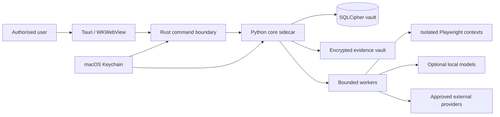

# ADR-001: Technology Stack

- Status: Accepted; Phase 2 packaging spikes completed and verified
- Date: 2026-07-11
- Decision owners: Product architecture, security, privacy, and desktop engineering
- Scope: macOS-first local application on Apple Silicon

## Context

Codename Ariadne handles an unusually sensitive, high-correlation data set. It needs a polished desktop interface, safe local file access, encrypted local persistence, browser automation, evidence processing, graph exploration, deterministic extraction, and optional local machine learning. It must run well on macOS, Apple M4 Max, 64 GB unified memory, and be straightforward to develop in VS Code.

The first implementation phase is UI-only, but its boundaries must survive the later local backend. Novelty is less important than maintainability, auditability, and least privilege.

## Decision

Use a Tauri 2 desktop application containing a React and strict-TypeScript UI built by Vite. Package a Python 3.12 FastAPI service as a local sidecar in Phase 2. Persist application state in SQLite with SQLCipher, model graph data relationally behind a graph-domain interface, store evidence as independently authenticated encrypted artifacts, and execute durable work through bounded in-process workers. Use deterministic extraction first and make local MLX/llama.cpp assistance optional.

### Selected stack

| Area | Decision |
|---|---|
| Desktop shell | Tauri 2, native arm64 first; universal package evaluated at release |
| Web UI | React 19, TypeScript strict mode, Vite 8, React Router |
| UI state | TanStack Query for service state; small Zustand stores for ephemeral workflow/UI state |
| Forms/schema | React Hook Form and Zod; generated service contracts remain authoritative |
| Components | Accessible Radix primitives, local design tokens, CSS Modules/custom CSS, Lucide icons |
| Motion | Motion with a single reduced-motion policy gate; CSS for simple state transitions |
| Graph | Cytoscape.js with deterministic layouts for tests; graph-domain data remains library-neutral |
| Geography | MapLibre GL added when the geographic view connects to real data; coarse private locations by default |
| Core service | Python 3.12, FastAPI, Pydantic 2, AnyIO |
| Persistence | SQLAlchemy 2, Alembic, SQLite 3.51.3+ with FTS5/JSON1 and SQLCipher |
| Secrets | macOS Keychain; no secrets in environment variables, command arguments, logs, or frontend storage |
| Evidence | Per-vault authenticated encryption using XChaCha20-Poly1305 or AES-256-GCM; immutable originals |
| Jobs | Durable SQLite task records, bounded AnyIO workers, per-provider semaphores, process pool for CPU-heavy work |
| Browser automation | Python Playwright for authorised adapters/evidence; TypeScript Playwright for UI/E2E/visual tests |
| Local AI | Deterministic rules first; optional user-selected local model via MLX/llama.cpp or loopback Ollama, LM Studio, and OpenAI-compatible runtimes; disabled by default; no-LLM mode always available |
| Testing | Vitest, React Testing Library, axe checks, Playwright; pytest for the later service |
| Tooling | Node 24 LTS, pnpm workspace, uv-managed Python 3.12, stable Rust, pinned lockfiles |
| Packaging | Tauri DMG/app; frozen Python sidecar after PyInstaller/Nuitka comparison spike |
| Release security | Hardened runtime, Developer ID signing of all nested binaries, notarisation and stapling, signed updater only |

All web fonts and visual assets are packaged locally. No CDN or telemetry dependency is allowed in the default application.

## Runtime shape

In packaged builds the webview does not call providers or the Python service directly. Tauri commands proxy typed requests and relay events over a `0600` Unix-domain socket. Development may use a random loopback port protected by an ephemeral token, strict Origin checks, authenticated bounded event replay, and no LAN binding.

## Alternatives considered

### Desktop application versus local web application

Decision: desktop application, with browser development mode retained.

A browser-only local service would simplify iteration but weakens secure file picking, Keychain integration, application locking, sandbox/capability controls, packaging, and consistent evidence storage. Tauri keeps the local service and vault within an explicit application boundary while Vite still provides rapid browser-based UI development.

### Tauri versus Electron versus browser-only

Decision: Tauri 2.

| Option | Strengths | Costs / reason rejected |
|---|---|---|
| Tauri 2 | Uses macOS WKWebView; small footprint; Rust boundary; granular capabilities; native dialogs and Keychain integration | Adds Rust, sidecar, entitlements, and nested-code-signing complexity; accepted |
| Electron | Mature ecosystem and uniform Chromium rendering | Bundled Chromium increases memory, disk footprint, update burden, and attack surface for a local-sensitive application |
| Browser-only | Lowest packaging effort | Weakest desktop security integration and least suitable for encrypted files, Keychain, auto-lock, and notarised distribution |

Tauri's capability system can constrain which local interfaces a webview may invoke, but it does not make unsafe Rust or overbroad scopes safe. Capability files therefore remain minimal and reviewed. See the [Tauri capability model](https://v2.tauri.app/security/capabilities/).

### TypeScript-only versus TypeScript plus Python

Decision: TypeScript UI plus Python core.

TypeScript-only would reduce IPC and packaging work, but Python has materially stronger, better-audited ecosystems for NLP, OCR, data processing, scientific scoring, OSINT adapters, and MLX integration. Python-only would compromise the high-fidelity frontend and desktop ecosystem. Typed OpenAPI/JSON Schema generation prevents hand-maintained contract drift.

The cost is two runtimes and a sidecar lifecycle. The boundary is deliberate: the webview owns presentation, the Rust shell owns capabilities and lifecycle, and Python owns untrusted-data processing and domain services.

### Python 3.12 versus the installed Python 3.13

Decision: pin Python 3.12 with uv for the packaged service; keep source compatible with 3.12+ where practical.

The host's Python 3.13.1 is suitable for scripts, but 3.12 currently offers the safer compatibility baseline for SQLCipher bindings, frozen binaries, OCR/NLP packages, and native extensions. The application must not mutate or depend on the macOS/system Python.

### SQLite versus PostgreSQL

Decision: SQLite.

SQLite requires no daemon, is easy to back up atomically, packages naturally with a local application, and provides FTS5 plus JSON support. WAL enables concurrent readers and a writer on one host. A serialized writer and bounded read pool match the application's local workload. PostgreSQL adds service installation, credentials, upgrades, and failure modes without a demonstrated single-user need.

SQLite must be 3.51.3 or newer (or a documented fixed backport) because the upstream WAL documentation identifies a rare multi-connection corruption bug fixed in 3.51.3. See [SQLite WAL](https://sqlite.org/wal.html) and [FTS5](https://www.sqlite.org/fts5.html).

### Relational graph versus dedicated graph database

Decision: relational node, edge, edge-evidence, and decision tables with a graph repository interface.

A dedicated database such as Neo4j adds a daemon, another query language, backup complexity, and a second security boundary. Indexed adjacency queries and recursive CTEs are sufficient for the expected personal graph scale; Cytoscape.js handles interaction and Python handles measured analytics. Revisit only if benchmarks show unacceptable traversal performance or graph size.

### In-process workers versus an external queue

Decision: durable SQLite jobs plus bounded in-process workers.

Redis/Celery or another broker would make installation and lifecycle management disproportionate for a single-device product. Job rows provide recovery, idempotency, retry, cancellation, and audit history. AnyIO task groups handle I/O; `ProcessPoolExecutor` handles CPU-bound OCR, hashing, embeddings, and image work where the GIL matters. Provider and browser concurrency is independently bounded.

### Local NLP versus remote LLM assistance

Decision: deterministic extraction first, local AI optional and disabled by default, remote AI off by default.

Rules and typed parsers produce reproducible evidence. Optional local models can enrich extraction, deduplication, or summarisation only when benchmarks show a measurable benefit. MLX is designed for Apple Silicon and uses unified CPU/GPU memory, making the M4 Max and 64 GB pool valuable without copying arrays between device memories. See [MLX unified memory](https://ml-explore.github.io/mlx/build/html/usage/unified_memory.html).

The optional extension must remain free of any required cloud or paid API dependency. The user chooses the model and may use a future in-process MLX/llama.cpp adapter or the implemented foundation for a user-managed Ollama, LM Studio, or compatible OpenAI-style service bound to an explicitly approved loopback endpoint. It must never discover LAN runtimes, follow redirects off loopback, or silently fall back to a cloud endpoint. Integrated use must record runtime/model identity, configuration digest, input provenance, resource budget, and output disposition without storing hidden reasoning.

Every inference remains separate from evidence and must be reviewable as an enrichment candidate. Deterministic extraction continues if the runtime is absent, disabled, incompatible, or over budget; the user can always run with no LLM. The disabled-by-default, loopback-only local-AI foundation, generated API/Rust boundary, desktop settings/model-selection UI, and review-only intake enrichment are implemented and tested. Any future remote model use requires a separate per-payload preview and explicit approval and cannot perform irreversible actions.

### Browser automation

Decision: Playwright in isolated, non-stealth contexts.

Playwright supports reproducible navigation, screenshots, PDFs, network metadata, and cross-browser UI testing. Production automation is policy-bound: ordinary public interaction only, no CAPTCHA bypass, stealth evasion, password-reset probing, or authenticated access without explicit authorisation. Contexts are short-lived, storage is isolated per task, downloads are quarantined, and concurrency is bounded.

### Encryption strategy

Decision: defence in depth rather than database encryption alone.

- FileVault is a host baseline, not the sole application control.
- SQLCipher protects structured vault data, including indexes and task/transmission history.
- Evidence artifacts use independent authenticated encryption and opaque UUID paths.
- A per-vault data-encryption key is wrapped by a Keychain-held key.
- Temporary files, WAL/SHM, backups, diagnostics, thumbnails, and exports receive explicit handling.
- Redacted exports are derivatives; originals are never overwritten.

A packaging and migration spike must prove the selected SQLCipher driver, SQLite version, WAL behaviour, backup API, and frozen sidecar before Phase 2 is accepted.

### Packaging and code signing

Decision: Tauri packaging with a frozen sidecar; sign inside out.

The service freezer will be chosen after comparing PyInstaller and Nuitka for arm64 reproducibility, startup time, SQLCipher/native-library loading, ML optionality, and notarisation. Every nested executable and library must be signed before the app bundle. Release builds use hardened runtime, Developer ID, notarisation, and stapling as described by [Tauri's macOS signing guide](https://v2.tauri.app/distribute/sign/macos/). Local Phase 1 validation may use an unsigned browser build and ad-hoc Tauri signing.

## Why this is optimal for the target

### macOS

Tauri integrates with WKWebView, native file dialogs, Keychain, sandboxing, entitlements, signing, notarisation, and the hardened runtime. A desktop bundle can enforce a stronger local boundary than a browser tab and can guide users away from cloud-synchronised vault locations.

### Apple M4 Max and 64 GB unified memory

The architecture can run bounded browser capture, OCR, hashing, graph analytics, and optional local embeddings concurrently while reserving capacity for a responsive UI. MLX can use shared CPU/GPU memory. Concurrency remains benchmark-driven—available memory is not permission to open uncontrolled browser sessions or load decorative models.

### VS Code

React/TypeScript, Python, Rust, Playwright, pytest, and generated schemas all have mature language-server, debugger, formatter, and task support. A single workspace exposes `pnpm`, `uv`, Cargo, privacy, test, and screenshot tasks without hiding commands in proprietary tooling.

### Local-first execution

SQLite/SQLCipher, Keychain, encrypted artifact storage, in-process workers, local model adapters, and a sidecar avoid required cloud services. External traffic is adapter-specific, visible, budgeted, and denied by default. Backups and exports remain explicit user actions.

## Consequences and follow-up decisions

Positive consequences:

- Small native shell and responsive modern UI.
- Strong separation between presentation, privileged commands, and data processing.
- No database or queue daemon.
- Excellent local NLP, OCR, automation, and Apple-Silicon options.
- Reproducible, typed interfaces and independent testing layers.

Accepted costs:

- Rust, Node, and Python toolchains must be bootstrapped and pinned.
- Sidecar lifecycle, IPC authentication, SQLCipher, native libraries, and nested signing require early spikes.
- Relational graph queries need careful indexes and benchmarks.
- Local models consume disk and memory, so they remain optional downloads.

Required follow-ups:

1. ADR-002: vault encryption, key hierarchy, lock/unlock, and backup format.
2. ADR-003: UI-to-core IPC and event protocol.
3. ADR-004: task durability, concurrency, and cancellation semantics.
4. Phase 2 spike: SQLCipher 3.51.3+ packaging and migration/backup verification.
5. Phase 2 spike: PyInstaller versus Nuitka sidecar and macOS notarisation.
6. Benchmark: Cytoscape graph size, FTS5 corpus size, worker limits, OCR, and optional MLX model profiles on the target Mac.
