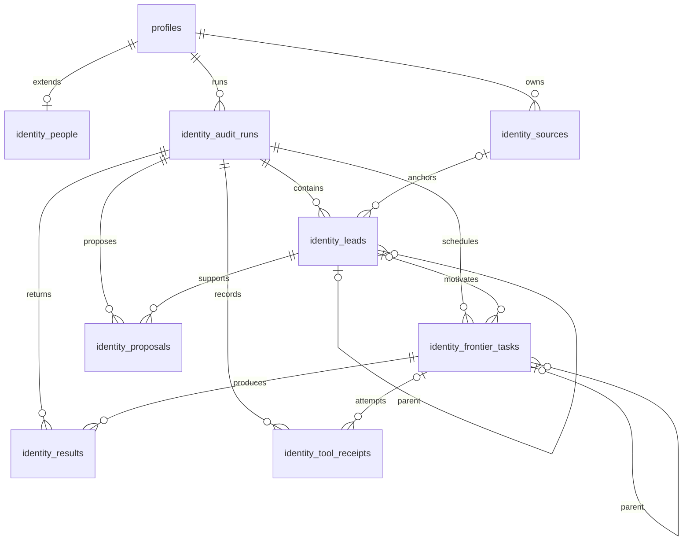
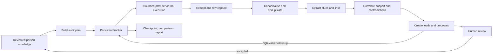

# Identity Discovery Engine

- Status: Accepted target architecture; first backend vertical slice implemented
- Date: 2026-07-22
- Scope: persistent people, durable audits, recursive discovery, proposals, evidence, and AI-directed tools

## Product centre

Ariadne is a local-first identity-discovery and self-audit engine. Its primary
journey is:

`Person -> audit -> frontier task -> lead -> knowledge proposal -> evidence`

The vault, policy preflight, provider controls, AI workspace, comparisons,
reports, and remediation support this journey. They are not separate workflows
that force the user to re-enter the same identifiers.

“Maximum coverage” means exhaust the enabled, authorised, and reachable search
space within explicit depth, request, time, rate, and cost limits. It is not a
claim that every page on the internet can be found. Authentication, challenges,
paywalls, robots rules, and provider access controls remain visible stop reasons;
Ariadne does not bypass them.

## Implemented backend slice (migration 0009)

This section describes the code as it exists after migration 0009. It is not a
description of the eventual full engine. The implemented slice provides a
persistent person workspace, durable recursive audit frontier, bounded public
search and page-fetch tools, deterministic extraction proposals, explicit
progress, and human proposal decisions.

It does **not** yet provide a background worker, automatic crash reconciliation,
model-directed planning, accepted-proposal promotion into canonical entities,
full evidence captures, or most registered tools. The target architecture after
this section remains the direction for those follow-up slices.

### Person and Profile relationship

`profiles` remains the canonical person record and owns the stable `profile_id`,
display label, purpose, status, and revision. The new `identity_people` table is
an optional one-to-one extension keyed by `(vault_id, profile_id)` for notes,
tags, and a separate details revision. Existing Phase 3 `entities` remain the
reviewed identity values used to seed discovery.

A person update is one transaction with two optimistic checks:

1. the `profiles.revision` must match `expected_profile_revision`; and
2. `identity_people` is inserted when `expected_details_revision` is zero, or
   updated when its stored revision matches the supplied value.

If either check fails, the transaction rolls back both changes. Tags are stored
as a bounded JSON array on `identity_people`; there is no separate tag table in
this slice.

### Implemented durable data model



| Table | Implemented responsibility |
| --- | --- |
| `identity_people` | One optional metadata extension per Profile/Person. Notes and tags are revisioned. |
| `identity_sources` | Person-scoped canonical public URLs with keyed URL HMAC, type, relationship state, latest HTTP status, content hash, and check time. Manual and fetched URLs share this library. |
| `identity_audit_runs` | Immutable-at-creation mode/provider/model/budget snapshot plus mutable state, stage, counters, progress, stop reason, timestamps, and revision. |
| `identity_leads` | Audit-local clue chain. A lead stores its parent, optional source, type, display value, keyed value HMAC, depth, support, contradictions, confidence, ownership, temporal, review, and expansion states. |
| `identity_frontier_tasks` | Durable scheduler rows with parent task/lead, closed task type, provider, encrypted-vault payload, keyed payload HMAC, masked display, priority, information gain, depth, attempts, retry timing, result count, stop reason, and revision. |
| `identity_results` | Deduplicated public results with the producing task, provider, rank, category, exact canonical URL, title, snippet, optional content hash, observation time, and review state. |
| `identity_proposals` | Extracted candidate knowledge with lead, value fingerprint, masked display, exact source URL/span, support, contradictions, confidence, temporal/review states, recommendations, and optional model attribution. |
| `identity_tool_receipts` | One record per completed broker attempt with task, tool, argument SHA-256, authorization/execution states, result code/count, optional model attribution, and timestamps. |

There is no separate audit-seed table in this slice. Reviewed entities and
person sources are converted atomically into root leads and frontier tasks when
an audit is created. There is also no separate model tool-invocation table;
`identity_tool_receipts` currently records deterministic broker attempts.

Every new table includes vault/profile scope in its ownership constraints.
Within an audit, task identity is unique by task type, provider, and keyed
payload HMAC. Results and proposals use keyed URL/value HMACs for idempotency.
Raw task payloads and canonical proposal values are stored only inside the
encrypted vault database and are excluded from dataclass representations.

### Implemented API and coordinator boundary

The authenticated local API exposes eight profile-scoped POST routes:

| Route | Operation |
| --- | --- |
| `/v1/identity/workspace` | Read one bounded person workspace. |
| `/v1/identity/person` | Compare-and-swap profile/details update. |
| `/v1/identity/source` | Normalize and idempotently add one authorized public URL. |
| `/v1/identity/audits` | Snapshot configuration and create an audit with seed leads/tasks. |
| `/v1/identity/audits/detail` | Read one bounded durable audit projection without executing it. |
| `/v1/identity/audits/execute` | Claim and execute one explicit batch of one to eight tasks. |
| `/v1/identity/audits/control` | Pause, resume, or cancel using an expected audit revision. |
| `/v1/identity/proposals/decision` | Record a proposal decision; `SEARCH_DEEPER` may add a task. |

Middleware admits only these exact method/path pairs, authenticates the launch
session, rejects replayed request IDs, and limits each request body to 32 KiB
before FastAPI parses it. OpenAPI metadata declares a 4 MiB response budget;
the current middleware does not independently enforce response byte counts.
Collections use count caps plus `has_more_*` flags at the schema boundary.

`IdentityDiscoveryCoordinator` is the application boundary. It checks that the
vault is unlocked for every operation, borrows the intake-fingerprint subkey for
one repository scope, translates repository failures into stable API errors,
and owns a process-local execution lock. That lock serializes batches and audit
control in one sidecar process; database task revisions provide the persistent
compare-and-swap guard.

### Execution and transaction boundary

An explicit execute request performs this sequence:

1. `claim_tasks` commits eligible tasks as `RUNNING`, increments attempt counts,
   and advances their revisions.
2. The coordinator closes that transaction and executes at most four broker
   calls in parallel. The API request itself caps a batch at eight tasks.
3. Each broker result is committed in its own short transaction with results,
   derived leads/proposals, child tasks, final task state, and a tool receipt.
4. `refresh_audit` recomputes counters, progress, stage, and terminal status from
   durable rows.

No database transaction spans provider or page network I/O. The UI or another
controller must explicitly request later batches; there is no autonomous
background audit loop in this slice.

### Exact frontier task state machine

The migration defines the following closed vocabulary. The repository currently
produces only the transitions listed here.

| State | Current producer and outgoing transition |
| --- | --- |
| `PLANNED` | Reserved in the schema; no current insert path. Cancellation can mark a pre-existing row `CANCELLED`. |
| `READY` | Normal seed, recursive fetch, deeper-search decision, or audit resume. A claim changes it to `RUNNING`; cancellation changes it to `CANCELLED`. |
| `QUEUED` | Reserved in the schema; no current insert path. Cancellation can mark it `CANCELLED`. |
| `RUNNING` | A claimed attempt. Completion uses broker outcome plus a revision check. |
| `SUCCEEDED_EMPTY` | Terminal provider outcome with zero results. |
| `SUCCEEDED_RESULTS` | Terminal outcome with one or more provider/page results. |
| `BLOCKED` | Terminal in this slice; used for refused/unsafe/blocked access. |
| `RATE_LIMITED` | Terminal in this slice; no automatic retry-after scheduling yet. |
| `AUTH_REQUIRED` | Terminal in this slice. HIBP seeds start here because no credentialed audit adapter is wired. |
| `FAILED_RETRYABLE` | Non-terminal. Once `next_attempt_at_us` is due, a later explicit batch may reclaim it. |
| `FAILED_TERMINAL` | Terminal invalid request, encoding, or exhausted-retry outcome. |
| `SKIPPED` | Terminal hard-stop outcome, currently used when the time budget is exhausted. |
| `CANCELLED` | Terminal user cancellation of work not yet running. |
| `REVIEW_REQUIRED` | Terminal broker outcome for registered but unimplemented tools or unsupported content. |
| `REVIEWED` | Reserved in the schema; no current transition writes it. |
| `SAVED` | Reserved in the schema; no current transition writes it. |

`TERMINAL_TASK_STATES` is exactly `SUCCEEDED_EMPTY`, `SUCCEEDED_RESULTS`,
`BLOCKED`, `RATE_LIMITED`, `AUTH_REQUIRED`, `FAILED_TERMINAL`, `SKIPPED`,
`CANCELLED`, `REVIEW_REQUIRED`, `REVIEWED`, and `SAVED`.

Retryable failures use exponential delays of one then two seconds with the
current retry limit of two. The third failed attempt becomes `FAILED_TERMINAL`
with `RETRY_LIMIT_EXHAUSTED`. Claims are ordered by descending priority,
descending expected information gain, then creation time.

Audit controls currently allow:

```text
READY | RUNNING --PAUSE--> PAUSED
PAUSED          --RESUME-> READY
READY | RUNNING | PAUSED --CANCEL--> CANCELLED
```

The current code writes audit stages `PLANNING`, `SEARCHING`, `REVIEW`, and
`COMPLETE`. Other declared stages are reserved for later extraction,
correlation, AI, and checkpoint slices. `DRAFT` and `FAILED` audit states are
also defined but not currently produced.

### Seed selection and recursive expansion

Normal audit seeds come only from existing entities that are:

- not deleted;
- reviewed as `CONFIRMED` or `PROBABLE`;
- marked `SEARCH_ALLOWED`; and
- marked `PROVIDER_ALLOWLIST` for transmission.

Person sources seed `FETCH_URL` unless their relationship state is
`UNRELATED`. Entity/provider combinations produce DuckDuckGo web searches,
GitHub username queries, or an `AUTH_REQUIRED` HIBP task. Incremental-like modes
suppress an equivalent prior successful task. `FULL_RESCAN` and
`MAXIMUM_COVERAGE` do not. `FAILED_AND_BLOCKED_RETRY` reconstructs selected
failed/blocked prior tasks as new roots.

Search results are deduplicated by URL HMAC. Each new result creates or reuses a
URL lead. The highest three ranks may create `FETCH_URL` child tasks when depth
and total request-task budget permit.

A successful page fetch:

- accepts at most 1 MiB of UTF-8 HTML, XHTML, or plain text;
- refuses redirects, cookies, proxies, authentication, and non-public DNS
  answers at preflight time;
- parses without rendering or executing active content;
- bounds HTML events, extracted text, and links;
- classifies the URL using deterministic social/forum/code/document/archive/
  public-record/media hints;
- schedules at most five ranked links per page within depth/request limits; and
- deterministically proposes extracted email, username, domain, URL, and
  telephone candidates with exact spans.

Page proposals are capped at 64 and at 850,000 confidence micros. They remain
`UNREVIEWED`; extraction does not establish ownership. Page text is retained as
a bounded result excerpt and SHA-256, not as a full immutable evidence original.

### Registered and implemented tool matrix

The registry is a closed command vocabulary. Registration means a task name can
be represented and rejected truthfully; it does not mean an adapter exists.

| Tool or provider surface | Current status | Execution path or honest outcome |
| --- | --- | --- |
| `SEARCH_WEB` / `DUCKDUCKGO_HTML` | Implemented | Existing bounded public-discovery DuckDuckGo adapter. |
| `QUERY_GITHUB` / `GITHUB_USERS` | Implemented | Existing bounded GitHub public-user adapter. |
| `FETCH_URL` / `DIRECT_PUBLIC_WEB` | Implemented | Bounded direct page GET plus deterministic parsing/extraction. |
| `SEARCH_PROVIDER` / `HAVE_I_BEEN_PWNED_V3` | Represented, not executable | Seed starts `AUTH_REQUIRED`; this slice has no audit credential handoff. |
| `MANUAL_BROWSER_HANDOFFS` | Selectable, no seed generator | Persisted in the provider snapshot but creates no task. |
| `SEARCH_SITE`, `SEARCH_DOMAIN`, `SEARCH_USERNAME` | Registered, not implemented | Broker returns `REVIEW_REQUIRED` / `TOOL_NOT_IMPLEMENTED` if such a task is introduced. |
| `PARSE_HTML`, `EXTRACT_LINKS`, `EXTRACT_IDENTIFIERS` | Registered as standalone tools, not implemented | Equivalent deterministic work currently occurs only inside `FETCH_URL`. |
| `QUERY_ARCHIVE`, `QUERY_REGISTRY`, `QUERY_DNS`, `QUERY_CERTIFICATE_TRANSPARENCY` | Registered, not implemented | Review-required non-execution. |
| `RUN_USERNAME_ENUMERATION`, `RUN_METADATA_EXTRACTION`, `RUN_OCR`, `HASH_IMAGE`, `COMPARE_IMAGES` | Registered, not implemented | Review-required non-execution. |
| `CAPTURE_SCREENSHOT`, `CAPTURE_HTML`, `CAPTURE_DOCUMENT` | Registered, not implemented | Review-required non-execution; no evidence capture is implied. |
| `GENERATE_QUERY_VARIANTS`, `ANALYSE_DOCUMENT`, `COMPARE_SOURCES` | Registered, not implemented | Review-required non-execution. |

The broker receives typed `FrontierTaskRecord` values and returns typed transient
`ToolExecution` values. It has no database, filesystem, shell, or arbitrary tool
dispatch interface. Model settings and a selected model ID are snapshotted on an
audit, but no model planner or model tool call executes in this backend slice.

### Implemented progress and stop semantics

Progress is recomputed from the durable frontier:

```text
progress_micros = 1_000_000                         when total_tasks == 0
progress_micros = terminal_tasks * 1_000_000 / total_tasks otherwise
```

Because search/page outcomes can add child tasks, `total_tasks` can grow and the
percentage can decrease. Results, leads, and proposals are counted directly
from their tables. No timer drives progress.

Current audit-level stop reasons are:

| Stop reason | Meaning |
| --- | --- |
| `NO_ELIGIBLE_KNOWLEDGE` | Written by audit creation when no seeds exist, but the immediate refresh currently replaces it with `FRONTIER_EXHAUSTED`. |
| `FRONTIER_EXHAUSTED` | No ready/active/retryable work, proposals, review-required tasks, or coverage failures remain; state is `COMPLETED`. |
| `REVIEW_REQUIRED` | The frontier is exhausted but a proposal or review-required task exists; state is `PARTIAL`, stage `REVIEW`. |
| `COVERAGE_INCOMPLETE` | The frontier is exhausted with blocked, rate-limited, authentication-required, or terminally failed tasks; state is `PARTIAL`. |
| `TIME_BUDGET_EXHAUSTED` | Written before a claim when elapsed time exceeds the snapshot budget and pending work becomes `SKIPPED`; the following refresh can currently replace it with `FRONTIER_EXHAUSTED`. |
| `USER_CANCELLED` | Explicit cancel marks eligible pending work `CANCELLED` and ends the run. |

Depth is enforced when child tasks are created. Request budget is enforced as a
cap on total frontier tasks. Time budget is checked before each claim. The cost
budget is stored but not yet consumed or enforced.

### Restart and crash behavior

Person metadata, sources, audit configuration, all frontier rows, results,
leads, proposals, receipts, and progress survive UI route changes and process
restart because SQLite is authoritative. Retryable failures can be reclaimed by
a later explicit batch after their durable retry timestamp.

The current slice does **not** implement task leases, claim expiry, or startup
reconciliation. A process crash after `READY -> RUNNING`, an unexpected broker
exception, or a failure while committing later results can leave a task in
`RUNNING`. Such a task is not currently reclaimed automatically. Therefore the
slice provides durable continuation for safely committed states, but it must not
yet be described as fully crash-recovering or unattended.

Pause and cancel are also batch-boundary controls. The process-local execution
lock means a control request does not interrupt a currently executing batch; it
applies after that batch leaves the critical section.

### Implemented receipts and provenance

Each completed task attempt appends an `identity_tool_receipts` row in the same
transaction as its outcome. The receipt records the audit/task/tool identity,
SHA-256 of the task argument, authorization and execution state, stable result
code, result count, optional model identity, and timestamps. The task also keeps
a small JSON summary containing whether an external request was expected, the
reason, and result count.

Results retain exact canonical source URLs and producing task/provider IDs.
Leads retain parent lead IDs; tasks retain parent task IDs. Proposals retain the
source URL and exact text span. Together these permit a source chain through the
current relational data.

Receipt fidelity is intentionally described narrowly: authorization is
currently recorded as `APPROVED` from audit-level self-authorization, receipt
start and finish use the completion timestamp, and no redirect chain, adapter
version, cost, response headers, full body, screenshot, or immutable evidence
artifact is retained. A source row has a parent column, but fetched-page source
upserts do not yet populate it; task and lead parents carry the crawl chain.

### Current limitations and required hardening

Before this slice can satisfy the full target architecture, the following are
required:

1. Recover stale `RUNNING` tasks with durable leases/attempt records and startup
   reconciliation; make partial result-commit failures explicitly retryable.
2. Make terminal audit refresh monotonic and preserve explicit stop reasons.
   The current refresh can overwrite `NO_ELIGIBLE_KNOWLEDGE` and
   `TIME_BUDGET_EXHAUSTED` with `FRONTIER_EXHAUSTED`.
3. Count only unresolved proposals when deciding `REVIEW_REQUIRED`. The current
   refresh uses the total proposal count, so reviewed proposals can keep a run
   in `PARTIAL`/`REVIEW`.
4. Enforce cost budgets and implement the distinct semantics of selected,
   monitoring, new-identifier, and maximum-coverage modes.
5. Connect the selected model through a bounded planner/tool-proposal loop; the
   current model fields are configuration snapshots only.
6. Add credentialed HIBP execution, manual-handoff receipts, and adapters for the
   registered-but-unimplemented tools without weakening the broker boundary.
7. Bind public DNS validation to the actual connection or use a transport that
   prevents DNS rebinding between preflight resolution and urllib connection.
8. Record actual attempt start/finish, authorization provenance, adapter version,
   retry/rate metadata, cost, and evidence/capture references in receipts.
9. Persist immutable fetched-page evidence and connect accepted proposals to
   canonical entities/origins; rejection should feed reusable exclusions.
10. Populate source parentage during crawl and retain every result-to-source and
   proposal-to-evidence edge needed for end-to-end provenance.
11. Integrate the frontier with the existing durable job/outbox/policy layers or
    provide equivalent leases, idempotency, disclosure accounting, and recovery.
12. Enforce declared response-size limits at runtime and add pagination cursors
    rather than relying only on capped aggregate projections.

## Target architecture beyond the implemented slice

The sections below are accepted design requirements and delivery direction.
They must not be read as claims that the current 0009 backend already implements
every provider, capture, model, policy, recovery, or evidence behavior.

## Existing records to reuse

The restructure extends the current encrypted model instead of duplicating it:

- `profiles` becomes the durable person aggregate. Existing profile IDs remain
  stable; UI language changes from profile to person where appropriate.
- `intake_sources`, `intake_segments`, `extraction_runs`, `entities`, variants,
  decisions, and origins remain the knowledge-ingestion and identity core.
  Manual knowledge enters through a typed manual source so it receives the same
  origin and decision history as imported knowledge.
- graph nodes, edges, edge origins, and decisions remain the explainable
  relationship projection.
- `jobs`, attempts, dependencies, leases, idempotency records, and the outbox
  remain the execution substrate. A browser component or in-memory task is never
  the source of truth for running work.
- Phase 4 providers, query runs, checks, approvals, budgets, and transmission
  ledger remain the policy and disclosure boundary. A query preflight is not an
  audit and does not prove that a provider was contacted.
- Phase 5 findings, immutable evidence originals, derivatives, attribution
  assessments, and decisions remain the evidence and attribution core.
- Phase 6 snapshots remain immutable comparison checkpoints. A checkpoint is a
  projection of an audit, not the mutable audit itself.
- Local-AI adapters remain model-selectable. Deterministic extraction must still
  work when no model is available.

## Minimum durable additions

Names below are conceptual contract names; migrations may use the repository's
phase prefix while a feature is being introduced.

| Record | Purpose | Essential relationships and invariants |
| --- | --- | --- |
| `person_details` | Notes and person-level metadata not represented by an entity | One row per profile; revisioned edits |
| `person_tags` | User-managed classification | Unique normalized tag per person |
| `source_links` | Navigable canonical URL library | Person-scoped; canonical URL fingerprint is unique among live links; retains first/last seen, page type, review state, and latest check |
| `audit_runs` | One dated execution for one person | Mode, configuration snapshot, budgets, state, pause/cancel state, counters, and terminal reason are durable |
| `audit_seed_refs` | Knowledge used to start a run | References existing entity, link, intake source, prior finding, or explicit new seed; never an unverifiable polymorphic value |
| `discovery_leads` | A discovered clue or source in one run | Parent lead or root seed, depth, extracted type/value reference, support, contradiction, confidence, ownership, temporal, review, and expansion states |
| `frontier_tasks` | Persistent work queue | Run and lead scoped; typed payload; priority factors; status; retries; lease; last attempt; stop reason; deduplicated by canonical task fingerprint |
| `provider_receipts` | Exact account of one attempted provider/tool operation | Task/attempt, adapter/version, request fingerprint, safe request view, timestamps, response status, rate/cursor data, and response/capture references |
| `knowledge_proposals` | Reviewable change to permanent person knowledge | Lead-backed; typed action; support and contradictions; confidence; reviewer decision; accepted proposals create normal entity/link origins |
| `tool_invocations` | Auditable LLM tool-broker command | Run/task, model and prompt-policy versions, command kind, validated parameters digest, approval, execution result, and receipt IDs |

Provider bodies, page captures, screenshots, HTML, documents, and API responses
belong in encrypted evidence storage. Queue rows contain bounded manifests and
opaque references, not unbounded content or credentials.

All new foreign keys include `vault_id` and `profile_id` where applicable. This
prevents a lead, proposal, task, source, or receipt from being attached to a
different person by ID alone.

## Person knowledge

A person is long-lived. An audit is a dated attempt to expand and assess that
person's knowledge. A person may have many audits; deleting or cancelling an
audit does not silently delete accepted knowledge.

Knowledge includes reviewed entities, variants, relationships, links, evidence,
notes, tags, exclusions, and false-positive fingerprints. Every value records
how it entered the system: manual edit, import span, deterministic extraction,
model proposal, provider result, or accepted discovery proposal.

The People area therefore supports create, select, rename, annotate, tag, edit,
merge, exclude, and start-audit operations. It also shows audit history, stale
sources, coverage gaps, unresolved proposals, and failed or blocked work. An
accepted manual URL immediately creates a source-link seed for the next audit or
for an explicitly requested deep dive.

## Audit modes and planning

The planner consumes current knowledge and previous audit state automatically.
It must not ask the user to retype reviewed identifiers. Supported modes are:

- `FULL_RESCAN`
- `INCREMENTAL`
- `NEW_IDENTIFIERS_ONLY`
- `FAILED_AND_BLOCKED_RETRY`
- `SELECTED_IDENTITIES`
- `SELECTED_PROVIDERS`
- `CHANGE_MONITORING`
- `MAXIMUM_COVERAGE`

The plan snapshots the selected providers, policies, budgets, depth, relevant
knowledge revisions, and model/tool configuration. Incremental planning skips a
still-current equivalent task unless the selected mode requires a rescan. A
full rescan creates new tasks and receipts; it never rewrites prior receipts.

The main UI exposes **Run full audit**. Advanced provider preflight remains
available for inspecting masked payloads and approvals, but normal audits call
the same policy layer internally.

## Durable recursive loop



Each successful task may append leads and follow-up tasks in one short database
transaction. Network, browser, OCR, and model work occurs outside that
transaction. In-memory workers are disposable projections of the frontier.

The frontier uses bounded parallel pools per resource class: provider requests,
browser pages, local processes, OCR, and model inference. Provider-specific rate
limits and cursors are durable. Claiming uses leases and revision checks so a
restart can requeue safe work without treating an abandoned attempt as success.

### Frontier task state

The product-facing state set is:

`PLANNED`, `READY`, `QUEUED`, `RUNNING`, `SUCCEEDED_EMPTY`,
`SUCCEEDED_RESULTS`, `BLOCKED`, `RATE_LIMITED`, `AUTH_REQUIRED`,
`FAILED_RETRYABLE`, `FAILED_TERMINAL`, `SKIPPED`, `CANCELLED`,
`REVIEW_REQUIRED`, `REVIEWED`, and `SAVED`.

These are discovery outcomes, not replacements for the lower-level job state
machine. A frontier transition and its job/outbox mutation commit atomically.
Terminal provider outcomes remain distinguishable: an empty result is not a
failure, and a blocked request is not evidence that no result exists.

### Priority

Priority is a deterministic score whose stored factors include exact-match
strength, source quality, unexplored depth, likelihood of new identifiers,
contradiction-resolution value, expected information gain, request/cost weight,
rate-limit pressure, and duplicate probability. The LLM may propose a bounded
adjustment with cited inputs; it cannot silently override policy or budgets.

## Website and forum expansion

`FETCH_URL` canonicalises the URL, applies access and budget policy, captures a
receipt, classifies the page, and extracts links and identifiers. Internal and
external links are ranked separately. High-value pages become frontier tasks;
low-value pages remain in the source library with their stop reason.

Forum adapters and generic HTML parsing recognise profiles, member pages, post
histories, threads, pagination, quoted usernames, signatures, avatars, dates,
bios, external links, feeds, sitemaps, JSON-LD, canonical URLs, and archives.
Every hop retains its parent lead, producing chains such as:

`search result -> forum profile -> post history -> thread -> quoted alias -> external site`

Adapter-specific parsers improve precision but never erase the generic capture
or its exact URL.

## Extraction, correlation, and proposals

Every provider result follows the same pipeline:

`raw result -> canonicalise -> deduplicate -> extract -> propose linkage -> detect contradictions -> score confidence -> queue follow-up -> review -> capture evidence`

Correlation records supporting signals and contradictions independently. Exact
identifiers, URLs, domains, avatar hashes, organisations, locations, dates,
bios, shared links, naming patterns, historical continuity, and mutual
references are signals—not automatic proof of ownership.

A new value first becomes a lead and then a knowledge proposal. The proposal
shows the full discovery chain, supporting and contradicting evidence,
confidence, temporal state, and suggested actions. `Confirm`, `Confirm as
historical`, `Probable`, `Reject`, `Unrelated`, and `Merge` are append-only human
decisions. Only an accepted proposal becomes reusable permanent knowledge.

## LLM investigation controller

The selected local model—or an explicitly configured alternative—acts as a
planner over bounded, cited records. It may rank leads, generate query variants,
interpret page structure, propose connections, identify gaps, and recommend the
next command. It does not receive implicit shell, database, filesystem, network,
or evidence-write authority.

The tool broker accepts only registered command kinds such as `SEARCH_WEB`,
`SEARCH_PROVIDER`, `FETCH_URL`, `PARSE_HTML`, `EXTRACT_LINKS`,
`EXTRACT_IDENTIFIERS`, `QUERY_ARCHIVE`, `QUERY_GITHUB`, `QUERY_REGISTRY`,
`QUERY_DNS`, `QUERY_CERTIFICATE_TRANSPARENCY`, `RUN_METADATA_EXTRACTION`,
`RUN_OCR`, `HASH_IMAGE`, `COMPARE_IMAGES`, and evidence capture commands.

For each proposed command the broker:

1. validates a strict versioned parameter schema;
2. resolves opaque person/lead/source references inside the core;
3. checks audit mode, provider policy, approval, budgets, depth, and deduplication;
4. enqueues a typed frontier task rather than executing arbitrary model text;
5. records model, registry, policy, and parameter digests; and
6. returns structured observations and receipt references for citation.

Model output is untrusted. It cannot invent a source, mark a proposal confirmed,
declare a branch exhausted, or mutate immutable evidence without deterministic
validation or human review. A deterministic planner remains available when AI
is disabled or unavailable.

## Receipts and exact provenance

Every attempted external operation produces a receipt, including empty,
blocked, rate-limited, authentication-required, and failed attempts. A receipt
stores or references:

- person, audit, frontier task, lead, job, and attempt IDs;
- provider, adapter, adapter version, operation, query reference, and timestamp;
- canonical request target and encrypted exact payload where retention permits;
- redirect chain, cursor/page, response code, outcome, retry guidance, and cost;
- hashes, content type, size, capture IDs, and parsing/extraction version; and
- the parent discovery path and resulting lead IDs.

Receipts describe execution. Immutable evidence originals preserve source
material. Findings cite evidence; proposals cite leads and evidence; accepted
knowledge cites the proposal decision and original origins. The UI can therefore
walk backward from any conclusion to the exact source and forward from any seed
to all discoveries it produced.

## Progress, recovery, and checkpoints

Progress is derived from durable work, never a timer or fixed percentage. The
run view reports queued, running, succeeded-empty, succeeded-results, blocked,
failed, review-required, and saved counts plus the active provider and branch.
Because recursive discovery can add work, the estimated percentage may decrease
when a valuable branch expands; counters and stage labels remain authoritative.

Pause stops new claims and lets active tasks reach safe checkpoints. Vault lock,
window focus changes, route changes, minimisation, and application exit do not
delete the run. On restart, expired leases are reconciled; safe retryable tasks
return to the frontier and uncertain effects require review. A run never becomes
successful merely because the process restarted.

Checkpoints capture current findings, coverage, unresolved proposals, stopped
branches, and knowledge revision. Completion creates a comparison against the
selected prior checkpoint and feeds the report and remediation queue.

## Stop conditions

Each branch ends with one explicit reason:

- high-value leads exhausted;
- no new identifiers or meaningful confidence gain;
- configured depth reached;
- request, time, or cost budget reached;
- provider exhausted, unavailable, rate-limited, or access-blocked;
- duplicate or recently current work skipped;
- user pause or cancellation; or
- review required before disclosure or expansion.

The audit is `COMPLETED` only when every selected branch has a recorded terminal
or review state. Mixed outcomes produce `PARTIAL`; they do not collapse into a
misleading success or zero-results claim.

## Core contracts

The first vertical slices require versioned contracts for:

- person list/create/read/update and manual knowledge/link ingestion;
- audit create/read/control (`start`, `pause`, `resume`, `cancel`) and progress;
- audit planning preview with modes, providers, depth, and budgets;
- frontier list and task/branch detail with receipts and stop reasons;
- proposal list/detail/decision;
- source library list/detail/recheck/deep-dive actions; and
- internal tool proposal, validation, enqueue, and invocation-result records.

Mutating commands require idempotency keys and expected revisions. UI responses
are bounded projections; evidence bytes and credentials never travel through a
generic route.

## Delivery slices

1. Promote profiles to People; add notes/tags/manual knowledge and source links.
2. Add durable audit runs, seed snapshots, frontier tasks, real progress, and
   restart recovery using the existing job engine.
3. Build incremental planning from knowledge, prior receipts, exclusions,
   failures, and coverage gaps.
4. Add the typed tool registry and LLM proposal broker with a deterministic
   fallback.
5. Execute a narrow recursive slice: reviewed username/URL -> public search ->
   page fetch -> extraction -> lead -> proposal -> exact source chain.
6. Add forum/page pagination and bounded deep-link traversal.
7. Connect accepted proposals back into entities, origins, graph, and future
   audit seeds.
8. Make **Run full audit** orchestrate the complete durable loop and checkpoint.
9. Expand provider adapters behind the same receipt, rate, and policy contracts.
10. Automate evidence capture, stale-source monitoring, comparison, reporting,
    and remediation creation.

Each slice ships schema, repository, domain service, generated contracts, Rust
allowlist/command, native UI, restart test, profile-separation test, provenance
test, and privacy scan together. Simulation-only screens do not satisfy a slice.

## Required verification

- Two people with similar identifiers never share knowledge, leads, tasks,
  evidence, receipts, proposals, or progress.
- Route changes, focus changes, vault lock/unlock, process termination, and app
  restart preserve the audit and safely recover frontier work.
- Duplicate commands and duplicate discoveries do not repeat an external effect
  or erase distinct source origins.
- Recursive traversal obeys depth, domain, request, time, cost, concurrency, and
  cancellation limits while retaining the complete path.
- Tool-broker tests reject unknown commands, extra parameters, prompt-injected
  commands, cross-person references, policy violations, and budget overruns.
- Proposal acceptance creates durable knowledge with exact origins; rejection
  becomes a reusable false-positive/exclusion signal.
- Empty, blocked, failed, and partial outcomes remain distinct in receipts,
  coverage, progress, checkpoints, and reports.
- Synthetic tests exercise the full vertical slice; private reference material
  and real personal data never enter source, fixtures, screenshots, or history.
