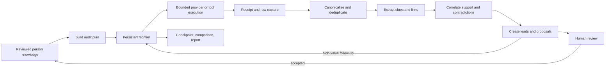

# Identity Discovery Engine

- Status: Accepted target architecture; implemented incrementally
- Date: 2026-07-22
- Scope: persistent people, durable audits, recursive discovery, proposals, evidence, and AI-directed tools

## Product centre

Ariadne is a local-first identity-discovery and self-audit engine. Its primary
journey is:

`Person -> audit -> frontier task -> lead -> knowledge proposal -> evidence`

The vault, policy preflight, provider controls, AI workspace, comparisons,
reports, and remediation support this journey. They are not separate workflows
that force the user to re-enter the same identifiers.

“Maximum coverage” means exhaust the enabled, authorised, and reachable search
space within explicit depth, request, time, rate, and cost limits. It is not a
claim that every page on the internet can be found. Authentication, challenges,
paywalls, robots rules, and provider access controls remain visible stop reasons;
Ariadne does not bypass them.

## Existing records to reuse

The restructure extends the current encrypted model instead of duplicating it:

- `profiles` becomes the durable person aggregate. Existing profile IDs remain
  stable; UI language changes from profile to person where appropriate.
- `intake_sources`, `intake_segments`, `extraction_runs`, `entities`, variants,
  decisions, and origins remain the knowledge-ingestion and identity core.
  Manual knowledge enters through a typed manual source so it receives the same
  origin and decision history as imported knowledge.
- graph nodes, edges, edge origins, and decisions remain the explainable
  relationship projection.
- `jobs`, attempts, dependencies, leases, idempotency records, and the outbox
  remain the execution substrate. A browser component or in-memory task is never
  the source of truth for running work.
- Phase 4 providers, query runs, checks, approvals, budgets, and transmission
  ledger remain the policy and disclosure boundary. A query preflight is not an
  audit and does not prove that a provider was contacted.
- Phase 5 findings, immutable evidence originals, derivatives, attribution
  assessments, and decisions remain the evidence and attribution core.
- Phase 6 snapshots remain immutable comparison checkpoints. A checkpoint is a
  projection of an audit, not the mutable audit itself.
- Local-AI adapters remain model-selectable. Deterministic extraction must still
  work when no model is available.

## Minimum durable additions

Names below are conceptual contract names; migrations may use the repository's
phase prefix while a feature is being introduced.

| Record | Purpose | Essential relationships and invariants |
| --- | --- | --- |
| `person_details` | Notes and person-level metadata not represented by an entity | One row per profile; revisioned edits |
| `person_tags` | User-managed classification | Unique normalized tag per person |
| `source_links` | Navigable canonical URL library | Person-scoped; canonical URL fingerprint is unique among live links; retains first/last seen, page type, review state, and latest check |
| `audit_runs` | One dated execution for one person | Mode, configuration snapshot, budgets, state, pause/cancel state, counters, and terminal reason are durable |
| `audit_seed_refs` | Knowledge used to start a run | References existing entity, link, intake source, prior finding, or explicit new seed; never an unverifiable polymorphic value |
| `discovery_leads` | A discovered clue or source in one run | Parent lead or root seed, depth, extracted type/value reference, support, contradiction, confidence, ownership, temporal, review, and expansion states |
| `frontier_tasks` | Persistent work queue | Run and lead scoped; typed payload; priority factors; status; retries; lease; last attempt; stop reason; deduplicated by canonical task fingerprint |
| `provider_receipts` | Exact account of one attempted provider/tool operation | Task/attempt, adapter/version, request fingerprint, safe request view, timestamps, response status, rate/cursor data, and response/capture references |
| `knowledge_proposals` | Reviewable change to permanent person knowledge | Lead-backed; typed action; support and contradictions; confidence; reviewer decision; accepted proposals create normal entity/link origins |
| `tool_invocations` | Auditable LLM tool-broker command | Run/task, model and prompt-policy versions, command kind, validated parameters digest, approval, execution result, and receipt IDs |

Provider bodies, page captures, screenshots, HTML, documents, and API responses
belong in encrypted evidence storage. Queue rows contain bounded manifests and
opaque references, not unbounded content or credentials.

All new foreign keys include `vault_id` and `profile_id` where applicable. This
prevents a lead, proposal, task, source, or receipt from being attached to a
different person by ID alone.

## Person knowledge

A person is long-lived. An audit is a dated attempt to expand and assess that
person's knowledge. A person may have many audits; deleting or cancelling an
audit does not silently delete accepted knowledge.

Knowledge includes reviewed entities, variants, relationships, links, evidence,
notes, tags, exclusions, and false-positive fingerprints. Every value records
how it entered the system: manual edit, import span, deterministic extraction,
model proposal, provider result, or accepted discovery proposal.

The People area therefore supports create, select, rename, annotate, tag, edit,
merge, exclude, and start-audit operations. It also shows audit history, stale
sources, coverage gaps, unresolved proposals, and failed or blocked work. An
accepted manual URL immediately creates a source-link seed for the next audit or
for an explicitly requested deep dive.

## Audit modes and planning

The planner consumes current knowledge and previous audit state automatically.
It must not ask the user to retype reviewed identifiers. Supported modes are:

- `FULL_RESCAN`
- `INCREMENTAL`
- `NEW_IDENTIFIERS_ONLY`
- `FAILED_AND_BLOCKED_RETRY`
- `SELECTED_IDENTITIES`
- `SELECTED_PROVIDERS`
- `CHANGE_MONITORING`
- `MAXIMUM_COVERAGE`

The plan snapshots the selected providers, policies, budgets, depth, relevant
knowledge revisions, and model/tool configuration. Incremental planning skips a
still-current equivalent task unless the selected mode requires a rescan. A
full rescan creates new tasks and receipts; it never rewrites prior receipts.

The main UI exposes **Run full audit**. Advanced provider preflight remains
available for inspecting masked payloads and approvals, but normal audits call
the same policy layer internally.

## Durable recursive loop

Each successful task may append leads and follow-up tasks in one short database
transaction. Network, browser, OCR, and model work occurs outside that
transaction. In-memory workers are disposable projections of the frontier.

The frontier uses bounded parallel pools per resource class: provider requests,
browser pages, local processes, OCR, and model inference. Provider-specific rate
limits and cursors are durable. Claiming uses leases and revision checks so a
restart can requeue safe work without treating an abandoned attempt as success.

### Frontier task state

The product-facing state set is:

`PLANNED`, `READY`, `QUEUED`, `RUNNING`, `SUCCEEDED_EMPTY`,
`SUCCEEDED_RESULTS`, `BLOCKED`, `RATE_LIMITED`, `AUTH_REQUIRED`,
`FAILED_RETRYABLE`, `FAILED_TERMINAL`, `SKIPPED`, `CANCELLED`,
`REVIEW_REQUIRED`, `REVIEWED`, and `SAVED`.

These are discovery outcomes, not replacements for the lower-level job state
machine. A frontier transition and its job/outbox mutation commit atomically.
Terminal provider outcomes remain distinguishable: an empty result is not a
failure, and a blocked request is not evidence that no result exists.

### Priority

Priority is a deterministic score whose stored factors include exact-match
strength, source quality, unexplored depth, likelihood of new identifiers,
contradiction-resolution value, expected information gain, request/cost weight,
rate-limit pressure, and duplicate probability. The LLM may propose a bounded
adjustment with cited inputs; it cannot silently override policy or budgets.

## Website and forum expansion

`FETCH_URL` canonicalises the URL, applies access and budget policy, captures a
receipt, classifies the page, and extracts links and identifiers. Internal and
external links are ranked separately. High-value pages become frontier tasks;
low-value pages remain in the source library with their stop reason.

Forum adapters and generic HTML parsing recognise profiles, member pages, post
histories, threads, pagination, quoted usernames, signatures, avatars, dates,
bios, external links, feeds, sitemaps, JSON-LD, canonical URLs, and archives.
Every hop retains its parent lead, producing chains such as:

`search result -> forum profile -> post history -> thread -> quoted alias -> external site`

Adapter-specific parsers improve precision but never erase the generic capture
or its exact URL.

## Extraction, correlation, and proposals

Every provider result follows the same pipeline:

`raw result -> canonicalise -> deduplicate -> extract -> propose linkage -> detect contradictions -> score confidence -> queue follow-up -> review -> capture evidence`

Correlation records supporting signals and contradictions independently. Exact
identifiers, URLs, domains, avatar hashes, organisations, locations, dates,
bios, shared links, naming patterns, historical continuity, and mutual
references are signals—not automatic proof of ownership.

A new value first becomes a lead and then a knowledge proposal. The proposal
shows the full discovery chain, supporting and contradicting evidence,
confidence, temporal state, and suggested actions. `Confirm`, `Confirm as
historical`, `Probable`, `Reject`, `Unrelated`, and `Merge` are append-only human
decisions. Only an accepted proposal becomes reusable permanent knowledge.

## LLM investigation controller

The selected local model—or an explicitly configured alternative—acts as a
planner over bounded, cited records. It may rank leads, generate query variants,
interpret page structure, propose connections, identify gaps, and recommend the
next command. It does not receive implicit shell, database, filesystem, network,
or evidence-write authority.

The tool broker accepts only registered command kinds such as `SEARCH_WEB`,
`SEARCH_PROVIDER`, `FETCH_URL`, `PARSE_HTML`, `EXTRACT_LINKS`,
`EXTRACT_IDENTIFIERS`, `QUERY_ARCHIVE`, `QUERY_GITHUB`, `QUERY_REGISTRY`,
`QUERY_DNS`, `QUERY_CERTIFICATE_TRANSPARENCY`, `RUN_METADATA_EXTRACTION`,
`RUN_OCR`, `HASH_IMAGE`, `COMPARE_IMAGES`, and evidence capture commands.

For each proposed command the broker:

1. validates a strict versioned parameter schema;
2. resolves opaque person/lead/source references inside the core;
3. checks audit mode, provider policy, approval, budgets, depth, and deduplication;
4. enqueues a typed frontier task rather than executing arbitrary model text;
5. records model, registry, policy, and parameter digests; and
6. returns structured observations and receipt references for citation.

Model output is untrusted. It cannot invent a source, mark a proposal confirmed,
declare a branch exhausted, or mutate immutable evidence without deterministic
validation or human review. A deterministic planner remains available when AI
is disabled or unavailable.

## Receipts and exact provenance

Every attempted external operation produces a receipt, including empty,
blocked, rate-limited, authentication-required, and failed attempts. A receipt
stores or references:

- person, audit, frontier task, lead, job, and attempt IDs;
- provider, adapter, adapter version, operation, query reference, and timestamp;
- canonical request target and encrypted exact payload where retention permits;
- redirect chain, cursor/page, response code, outcome, retry guidance, and cost;
- hashes, content type, size, capture IDs, and parsing/extraction version; and
- the parent discovery path and resulting lead IDs.

Receipts describe execution. Immutable evidence originals preserve source
material. Findings cite evidence; proposals cite leads and evidence; accepted
knowledge cites the proposal decision and original origins. The UI can therefore
walk backward from any conclusion to the exact source and forward from any seed
to all discoveries it produced.

## Progress, recovery, and checkpoints

Progress is derived from durable work, never a timer or fixed percentage. The
run view reports queued, running, succeeded-empty, succeeded-results, blocked,
failed, review-required, and saved counts plus the active provider and branch.
Because recursive discovery can add work, the estimated percentage may decrease
when a valuable branch expands; counters and stage labels remain authoritative.

Pause stops new claims and lets active tasks reach safe checkpoints. Vault lock,
window focus changes, route changes, minimisation, and application exit do not
delete the run. On restart, expired leases are reconciled; safe retryable tasks
return to the frontier and uncertain effects require review. A run never becomes
successful merely because the process restarted.

Checkpoints capture current findings, coverage, unresolved proposals, stopped
branches, and knowledge revision. Completion creates a comparison against the
selected prior checkpoint and feeds the report and remediation queue.

## Stop conditions

Each branch ends with one explicit reason:

- high-value leads exhausted;
- no new identifiers or meaningful confidence gain;
- configured depth reached;
- request, time, or cost budget reached;
- provider exhausted, unavailable, rate-limited, or access-blocked;
- duplicate or recently current work skipped;
- user pause or cancellation; or
- review required before disclosure or expansion.

The audit is `COMPLETED` only when every selected branch has a recorded terminal
or review state. Mixed outcomes produce `PARTIAL`; they do not collapse into a
misleading success or zero-results claim.

## Core contracts

The first vertical slices require versioned contracts for:

- person list/create/read/update and manual knowledge/link ingestion;
- audit create/read/control (`start`, `pause`, `resume`, `cancel`) and progress;
- audit planning preview with modes, providers, depth, and budgets;
- frontier list and task/branch detail with receipts and stop reasons;
- proposal list/detail/decision;
- source library list/detail/recheck/deep-dive actions; and
- internal tool proposal, validation, enqueue, and invocation-result records.

Mutating commands require idempotency keys and expected revisions. UI responses
are bounded projections; evidence bytes and credentials never travel through a
generic route.

## Delivery slices

1. Promote profiles to People; add notes/tags/manual knowledge and source links.
2. Add durable audit runs, seed snapshots, frontier tasks, real progress, and
   restart recovery using the existing job engine.
3. Build incremental planning from knowledge, prior receipts, exclusions,
   failures, and coverage gaps.
4. Add the typed tool registry and LLM proposal broker with a deterministic
   fallback.
5. Execute a narrow recursive slice: reviewed username/URL -> public search ->
   page fetch -> extraction -> lead -> proposal -> exact source chain.
6. Add forum/page pagination and bounded deep-link traversal.
7. Connect accepted proposals back into entities, origins, graph, and future
   audit seeds.
8. Make **Run full audit** orchestrate the complete durable loop and checkpoint.
9. Expand provider adapters behind the same receipt, rate, and policy contracts.
10. Automate evidence capture, stale-source monitoring, comparison, reporting,
    and remediation creation.

Each slice ships schema, repository, domain service, generated contracts, Rust
allowlist/command, native UI, restart test, profile-separation test, provenance
test, and privacy scan together. Simulation-only screens do not satisfy a slice.

## Required verification

- Two people with similar identifiers never share knowledge, leads, tasks,
  evidence, receipts, proposals, or progress.
- Route changes, focus changes, vault lock/unlock, process termination, and app
  restart preserve the audit and safely recover frontier work.
- Duplicate commands and duplicate discoveries do not repeat an external effect
  or erase distinct source origins.
- Recursive traversal obeys depth, domain, request, time, cost, concurrency, and
  cancellation limits while retaining the complete path.
- Tool-broker tests reject unknown commands, extra parameters, prompt-injected
  commands, cross-person references, policy violations, and budget overruns.
- Proposal acceptance creates durable knowledge with exact origins; rejection
  becomes a reusable false-positive/exclusion signal.
- Empty, blocked, failed, and partial outcomes remain distinct in receipts,
  coverage, progress, checkpoints, and reports.
- Synthetic tests exercise the full vertical slice; private reference material
  and real personal data never enter source, fixtures, screenshots, or history.
