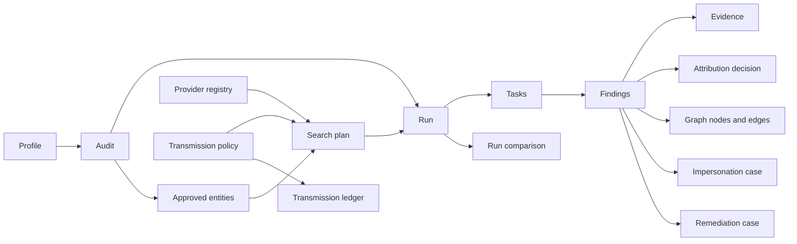

# Codename Ariadne — Information Architecture

- Status: Phase 1 implementation contract
- Date: 2026-07-11
- Scope: high-fidelity, local-only interactive prototype
- Source of truth: `Instructions/CODEX_MASTER_PROMPT_ARIADNE.md` and `docs/requirements.md`
- Privacy: all examples and prototype records are synthetic; no confidential-reference content is used here

## 1. Purpose

This document defines the screen hierarchy, routes, navigation, responsive behavior, state model, and four synthetic journeys for the Phase 1 interface. It is an implementation contract rather than a loose sitemap.

Phase 1 demonstrates the complete interaction model with deterministic in-memory fixtures. It performs no provider traffic, account connection, evidence capture from the web, or irreversible action. Every simulated run and result is visibly labelled **Simulated** and **Synthetic data**.

## 2. Information-architecture principles

1. **Decision before execution.** Intake, entity approval, sensitivity, provider exposure, query budget, and final review remain separate, legible steps.
2. **Outcome is not attribution.** Check outcome, visibility, ownership, confidence, sensitivity, provenance, and temporal validity are independent fields and never collapse into one color or score.
3. **Provenance stays one action away.** Every finding, graph edge, comparison, and remediation item links to its supporting source and evidence record.
4. **Failures remain visible.** Blocked, failed, unauthorised, rate-limited, unavailable, ambiguous, and unchecked work is retained in coverage and execution views.
5. **Context survives navigation.** Audit/run context, filters, scroll position, and the initiating route survive visits to details, evidence, and policy preflight.
6. **Privacy is a workflow, not a preference.** Transmission controls appear at the point of disclosure as well as in global settings.
7. **Human decisions are explicit.** Attribution, impersonation, remediation, and external submission cannot be inferred from a button click elsewhere.
8. **Dense, not cryptic.** The interface can show expert-level detail while retaining plain labels, progressive disclosure, and keyboard access.

## 3. Product object model

The primary objects and their relationships determine the navigation model:



The app must communicate these distinctions:

| Object | Meaning in the UI | Must not be presented as |
|---|---|---|
| Audit | A durable investigation definition and its approved scope | A single execution |
| Run | One execution snapshot of an audit or standalone trace | Proof of complete coverage |
| Task | One provider/action unit within a run | A finding |
| Finding | A normalised claim returned by a source | Confirmed ownership |
| Evidence | A captured artifact and its metadata | Proof that source content is true |
| Attribution decision | A recorded human conclusion with rationale | A hidden score threshold |
| Provider policy | Permission and risk rules for a source | Consent for all future runs |
| Remediation case | Tracked follow-up work | An automatically sent legal request |

## 4. Application shell

### 4.1 Persistent regions

The authenticated, unlocked shell has six regions in logical source order:

1. **Skip link** — first focus target; moves focus to the page heading/main landmark.
2. **Title bar** — product identity, synthetic-mode indicator, vault/lock state, command search, global activity, and profile switcher. It respects the macOS traffic-light safe area.
3. **Primary navigation** — stable destinations grouped by user intent; the active item is expressed by text, shape, and `aria-current`, not color alone.
4. **Context bar** — breadcrumbs, active audit/run, scope badge, last-updated time, and route-level actions.
5. **Main canvas** — one `main` landmark with one visible `h1`; page content follows a consistent summary-to-detail order.
6. **Context inspector** — optional evidence, filter, task, or explanation drawer. It is a sibling pane on wide screens and a modal sheet on compact screens.

A compact **activity strip** may appear at the bottom while a run is active. It shows real or explicitly simulated state, opens `/operations/:runId`, and never obscures primary actions.

### 4.2 Shell states

| Shell state | Behavior |
|---|---|
| First launch | Explains local-first storage and opens the synthetic workspace; no data import is implicit |
| Locked | Replaces all sensitive content with the unlock surface; navigation and previews do not leak values |
| Unlocked / idle | Normal navigation, no activity strip |
| Run active | Persistent activity strip with phase, completed/total tasks, warnings, and pause/cancel access |
| Degraded service | Non-blocking global banner, preserved local content, details and retry action |
| Privacy hold | Blocking preflight when a requested disclosure exceeds current policy |
| Offline | Local features remain available; provider work is labelled not checked rather than absent |

### 4.3 Navigation hierarchy

The primary rail is intentionally grouped so results, investigative tools, and disclosure governance do not blur together.

| Group | Destination | Canonical route | Purpose |
|---|---|---|---|
| Overview | Mission Control | `/dashboard` | Attention, active work, coverage, recent audits, and next actions |
| Audit | New Audit | `/audits/new` | Start the reviewed full-audit workflow |
| Audit | Operations | `/operations/:runId` | Observe and control one run |
| Audit | Findings | `/findings` | Triage and resolve normalised results |
| Explore | Link Map | `/graph` | Identity and provenance graph |
| Explore | Geographic Map | `/map` | Coarse location and jurisdiction context |
| Investigate | Tool Console | `/tools` | Launch one targeted or standalone tool |
| Investigate | Case Desk | `/cases/impersonation/:caseId` | Examine a specific impersonation case; index opens through Case Desk action/search |
| Track | Compare Runs | `/compare` | Compare two snapshots |
| Track | Removal Tracker | `/remediation` | Track correction, deletion, deindexing, and reporting work |
| Control | Source Radar | `/providers` | Provider coverage, health, terms, jurisdiction, and risk |
| Control | Transmission | `/privacy/transmission` | Policy, approval queue, and transmission ledger |
| System | Privacy & Settings | `/settings/privacy` | Local privacy, lock, retention, connectors, AI, appearance, and motion tabs |

`/states` is a development and review route. It is available in development and screenshot builds, excluded from production navigation, and never included in a release package unless explicitly enabled.

## 5. Canonical route map

The Phase 1 public route contract is:

```text
/
└── redirect → /dashboard

/dashboard

/audits/new
├── /audits/new/intake
└── /audits/new/entities

/tools
/operations/:runId
/findings
/findings/:findingId
/graph
/map
/cases/impersonation/:caseId
/compare
/remediation
/providers
/privacy/transmission
/settings/privacy
/states                         # development/review only
```

Rules:

- Canonical paths do not encode a profile name, email address, username, source URL, or other user input.
- IDs are opaque identifiers. The UI shows a short display ID and exposes the complete value through an accessible copy action.
- Audit context is retained in a scoped store and reflected in an `audit` query parameter only when a destination can legitimately be opened outside an audit.
- Filters, sort, selected tab, and comparison pair use shareable query parameters. Sensitive values do not.
- Drawers use route-aware selection (`?inspect=`) only for opaque IDs. Closing a drawer restores the initiating focus and route.
- The browser back action must undo the last meaningful navigation or overlay, never discard a completed review decision.

### 5.1 New-audit step state

The canonical URLs above remain compact while the wizard exposes these ordered steps:

| Step | Route/state | Completion rule |
|---|---|---|
| 1. Audit type | `/audits/new` | Full audit or authorised scope selected |
| 2. Intake | `/audits/new/intake` | At least one safe source segment exists, or an explicit no-import targeted scope is chosen |
| 3. Entity review | `/audits/new/entities` | Every extracted entity is approved, excluded, or stored-only |
| 4. Transmission | `/audits/new/entities?step=transmission` | Every sensitive disclosure has an explicit policy result |
| 5. Search plan | `/audits/new/entities?step=plan` | Generated queries and providers are inspectable |
| 6. Budget | `/audits/new/entities?step=budget` | Query count, duration, cost, and risk limits are acknowledged |
| 7. Final review | `/audits/new/entities?step=review` | Scope, exclusions, coverage limitations, and simulation status are visible |

The query values above identify UI steps only and contain no identity data. Deep links to later steps redirect to the earliest incomplete prerequisite with an explanation.

## 6. Screen inventory and content hierarchy

Each surface below is required for Phase 1. “Proof states” are deterministic fixtures used in interaction and screenshot review; they are not claims about production behavior.

| Surface | Route | Primary content hierarchy | Required Phase 1 proof states |
|---|---|---|---|
| Application shell | All shell routes | Product/vault status → navigation → context → page → optional inspector/activity | first launch, locked, unlocked, degraded, active simulated run |
| Navigation | All shell routes | Intent groups → active destination → status counts | expanded, icon rail, keyboard focus, long label |
| Mission Control | `/dashboard` | Attention queue → active/recent run → coverage summary → unresolved limitations → next actions | first-use empty, ready, active run, degraded providers, loading |
| New Audit | `/audits/new` | Audit type → scope/profile → local-only default → continue | new, saved draft, validation error |
| Free-text and file intake | `/audits/new/intake` | Local-processing notice → paste/drop/import → source segments → restricted-value quarantine → continue | empty, parsing, accepted files, unsupported file, oversize, quarantine, parse failure |
| Extracted-entity review | `/audits/new/entities` | Review progress → entity table → edit/classify → sensitivity/search permission → provenance → approval | loading, grouped ready, low-confidence queue, conflict, excluded, restricted/quarantined, no entities |
| Transmission/search-plan/budget review | `/audits/new/entities?step=transmission|plan|budget|review` | Policy mode → exact disclosures → provider/jurisdiction → queries/variants → budget → limitations → start | local-only, approval needed, denied, partial plan, over budget, final ready |
| Tool launcher | `/tools` | Search/filter → tool groups → capability/risk cards → recent standalone traces | catalog ready, no filter matches, unavailable tool, provider-policy warning |
| Live operations console | `/operations/:runId` | Simulated label → phase/ETA/cost → controls → workers/queues → provider tasks → log → human actions | queued, running, paused, partial, completed, failed, blocked, rate-limited, cancelled |
| Findings inbox | `/findings` | Saved views/counts → filter/sort → finding list/table → bulk review → coverage limitations | empty, loading, dense ready, partial, ambiguous, long identifiers, filter no-match, degraded source |
| Finding detail and evidence | `/findings/:findingId` | Claim/outcome → attribution state → signals/contradictions/gaps → provenance → evidence metadata/preview → decisions/actions | ready, evidence loading, missing artifact, hash verified, hash warning, access blocked, redacted view |
| Identity/provenance graph | `/graph` | Search/focus → filters → graph canvas → selected node/edge → why-connected explanation → evidence | empty, loading, small, dense, selected edge, hidden private nodes, layout failure, reduced motion |
| Geographic map | `/map` | Privacy mode → time/filter controls → coarse map → selected region → source/confidence → jurisdiction overlay | no locations, coarse private, public locations, mixed dates, map tiles unavailable, reduced motion |
| Impersonation case | `/cases/impersonation/:caseId` | Careful case status → identity claim → ownership timeline → identifier comparison → evidence → gaps → human classification → draft report | unclassified, possible, conflict, likely collision, needs evidence, draft ready, capture blocked |
| Audit comparison | `/compare` | Run pair → coverage compatibility → change summary → NEW/CHANGED/REMOVED/REAPPEARED queues → detail | choose runs, loading, ready, incompatible scope warning, no material change, failed comparison |
| Remediation board | `/remediation` | Deadlines/attention → status lanes/list → case details → evidence/templates → history → next approved action | empty, board/list ready, overdue, waiting, reappeared, action draft, blocked/manual |
| Provider registry / Source Radar | `/providers` | Coverage and outages → provider filters → provider table → jurisdiction/risk/retention → terms/removal route | loading, healthy mix, unavailable, unknown retention, auth required, disabled broker, no-match |
| Jurisdiction and transmission controls | `/privacy/transmission` | Current mode → pending approvals → allow/block policy → risk matrix → ledger → retention unknowns | local-only, EU-only, worldwide warning, custom conflict, approval pending/denied, empty ledger |
| Privacy and settings | `/settings/privacy` | Lock/encryption posture → data/retention → redaction/export → connectors → local AI → appearance/motion | defaults, unsaved, saved, validation error, connector disconnected, model unavailable, reduced motion |
| State laboratory | `/states` | Component/route selector → state controls → viewport/contrast/motion toggles → rendered specimen | empty, loading, failure, blocked/manual, restricted, offline, locked, overflow, reduced motion |
| Export review | Contextual sheet from `/findings`, `/compare`, or `/remediation` | Scope → full/redacted choice → redaction preview → included limitations → destination → explicit export | redacted default, sensitive warning, invalid destination, export progress, success/failure |

The contextual export sheet is not a standalone canonical route in Phase 1. It must still be fully interactive and included in visual/state review because export closes three core journeys.

## 7. Tool Console taxonomy

`/tools` exposes all required tools with clear functional names. Catalog groups aid scanning but never replace the name.

| Group | Tools |
|---|---|
| Trace an identifier | Email Trace, Username Sweep, Name Search, Phone Trace, Address Search, Domain Scan, URL Inspector, Company Search |
| Inspect media and history | Image Match, Repository Scan, Archive Search, Public Records Search |
| Use authorised/local data | Inbox Account Finder, GitHub Exposure Review, Local File Search |
| Preserve and analyse | Evidence Capture, Compare Runs, Removal Tracker |
| Monitor and resolve | Source Radar, Link Map, Case Desk |

Selecting a tool opens an in-page configuration workspace. It shows, in order: input; normalised variants; save-to-profile behavior; selected adapters; provider/operator/hosting jurisdictions; exact or masked disclosure; expected cost and duration; query budget; and the final run action. A policy conflict sends the user to a context-preserving transmission preflight rather than silently changing settings.

## 8. Shared state and status grammar

### 8.1 Page-level states

Every data-bearing screen supports a deliberate state contract:

| State | Presentation and action |
|---|---|
| Initial/empty | Explains why the surface is empty and offers one safe next action; never fabricates activity |
| Loading | Structure-preserving skeleton, visible label for screen readers, no fake final values |
| Ready | Content plus timestamp/provenance appropriate to the surface |
| Partial/degraded | Preserves available content, identifies missing providers/tasks, links to details/retry |
| Stale | Shows age and reason; does not silently present cached data as current |
| Paused | Preserves queue and progress; resume and cancel remain explicit |
| Complete | Summarises coverage and unresolved limits, not “all clear” |
| Failure | Plain-language cause, stable error code, retry/manual alternative, retained prior work |
| Blocked/manual action | Identifies the access boundary and supplies a lawful guided-capture/import path |
| Locked/redacted | Conceals sensitive values while preserving enough structure to recover or navigate safely |

Loading, empty, failure, and blocked/manual states must be visually complete layouts, not a centered sentence floating in an otherwise broken page.

### 8.2 Check outcomes

Provider/task outcomes use the exact domain vocabulary:

- `FOUND`
- `NOT_FOUND`
- `NOT_CHECKED`
- `CHECK_FAILED`
- `ACCESS_BLOCKED`
- `AUTH_REQUIRED`
- `RATE_LIMITED`
- `PROVIDER_UNAVAILABLE`
- `AMBIGUOUS`
- `MANUAL_REVIEW_REQUIRED`
- `AUTHORITATIVE_ABSENCE`, only when an authoritative source supports it

`NOT_FOUND` means that one defined check returned no matching result. It never becomes “does not exist.” Empty, unavailable, blocked, failed, and unindexed checks remain visible in the coverage matrix.

### 8.3 Independent evidence dimensions

A finding row and detail header allocate separate visual slots for:

| Dimension | UI expression |
|---|---|
| Check outcome | Text badge with icon and stable semantic tone |
| Visibility/exposure | Public, authorised-private, unknown, or not observed label |
| Ownership/attribution | Confirmed, probable, possible, non-match, unresolved, or needs evidence |
| Confidence | Named band plus evidence explanation; numeric score is secondary |
| Sensitivity | Public, sensitive, highly sensitive, or restricted shield label |
| Provenance | Provider/source link, capture time, and evidence reference |
| Temporal validity | Current, historical, date-bounded, or unknown |

No row may use one green/red badge to imply all seven dimensions.

### 8.4 Deterministic simulation

Phase 1 fixture playback uses a seeded clock and ordered event script. It must:

- show a persistent **Simulated run — no external requests** label;
- produce the same sequence under the same scenario seed;
- allow pause, resume, cancel, retry, and skip-provider interactions locally;
- expose failure, block, rate-limit, and manual-action branches;
- never write outside the prototype store;
- never use a real host, identity, provider account, or private location;
- use reserved `.invalid` hosts for any illustrative URLs or email-shaped values.

## 9. Four synthetic journeys

### 9.1 Full audit

Fixture: `Synthetic profile 01`; the pasted material uses generic invented entities and reserved `.invalid` hosts.

```text
/dashboard
→ /audits/new
→ /audits/new/intake
→ /audits/new/entities
→ transmission step
→ plan step
→ budget step
→ final review
→ /operations/:runId
→ /findings
→ /findings/:findingId
→ /graph
→ evidence inspector
→ /remediation
→ redacted export review
```

Success criteria:

- The user can paste text and add each supported MVP file type through synthetic fixtures.
- Restricted-looking sample values are quarantined and cannot advance into a query plan.
- Every extracted entity receives an explicit review outcome.
- Provider, jurisdiction, purpose, masking, retention knowledge, cost, and risk appear before a sensitive disclosure.
- The plan exposes variants and budget rather than silently expanding queries.
- The operations console includes successful, failed, blocked, and manual tasks.
- The finding detail separates source outcome from attribution and links every claim to evidence.
- The graph explains a selected edge in prose and provides a non-visual equivalent.
- Export defaults to redacted and includes coverage limitations.

### 9.2 Targeted trace

Fixture: a generic `sample_handle` or `operator@example.invalid`; no value is sent externally.

```text
/tools
→ select Email Trace or Username Sweep
→ enter one synthetic value
→ inspect normalised variants
→ review provider and jurisdiction exposure
→ approve/deny each disclosure
→ /operations/:runId
→ /findings
→ /findings/:findingId
→ /graph
→ save to Synthetic profile 01 or keep isolated
```

Success criteria:

- All required identifier tool types are discoverable by keyboard and filter.
- Local-only mode remains the default and produces a clear zero-transmission summary.
- A denied provider remains `NOT_CHECKED`; it is not treated as no result.
- The trace can remain isolated without creating or modifying a profile.
- Save-to-profile is a deliberate final action with a review of added nodes and edges.

### 9.3 Re-audit

Fixture: two deterministic snapshots of the same synthetic audit with compatible and intentionally incompatible coverage examples.

```text
/dashboard
→ choose prior synthetic audit
→ rerun all or selected checks
→ /operations/:runId
→ /compare
→ inspect NEW / CHANGED / REMOVED / REAPPEARED
→ open changed finding
→ /remediation
→ update monitoring state
```

Success criteria:

- The pair selector shows dates, scope, policy, and coverage compatibility.
- Diff state, source availability, content change, and attribution decision remain separate.
- Removed does not imply deleted; deindexed and archived are distinct.
- The user can jump from a diff to both versions and their evidence.
- Remediation history records a user decision without sending an action.

### 9.4 Impersonation investigation

Fixture: `Synthetic case 01` with conflicting generic signals and no real platform or person.

```text
/findings/:findingId
→ /cases/impersonation/:caseId
→ review claimed identity and careful status language
→ compare identifiers
→ compare ownership/activity timeline
→ inspect supporting and contradicting evidence
→ add a synthetic ownership period
→ preserve a mock evidence record
→ classify outcome or leave unresolved
→ prepare a draft report
```

Success criteria:

- The default status is unresolved; no score automatically accuses or attributes.
- The timeline distinguishes account identity, username ownership, and activity periods.
- Supporting signals, contradictions, missing evidence, and recommended verification are visible together.
- Classification requires an explicit human decision and rationale.
- The report is visibly **Draft only** and has no send/submit action in Phase 1.

## 10. Responsive hierarchy

Phase 1 is a macOS desktop application, not a phone interface. It must nevertheless reflow cleanly at the required narrow-laptop viewport and at 200% content zoom.

| Mode | Reference viewport | Shell behavior | Content behavior |
|---|---|---|---|
| Wide | 1728 × 1117 and above | 232 px labelled rail; main canvas; 360 px inspector can remain docked | Multi-column summaries; table plus inspector; graph controls and detail coexist |
| Standard | 1440 × 900 | 208 px labelled rail; inspector overlays unless explicitly pinned and space remains | Two-column summaries; sticky page actions; tables prioritise core columns |
| Compact laptop | 1100 × 800 | 68 px icon rail with labelled tooltips/accessible names; inspector becomes modal sheet | Single-column forms; cards become list rows; secondary table fields move to disclosure; no page-level horizontal overflow |
| Minimum supported | 960 × 680 | Icon rail; command/search moves into palette; sheets occupy available width without covering close controls | One primary work region; graph/map retain canvas pan but controls become a sheet |

Responsive rules:

- Document source order remains meaningful when columns collapse.
- Primary action and safety status remain visible before secondary analytics.
- All grid and flex children use `min-inline-size: 0`; long IDs, URLs, filenames, and translated labels cannot force shell overflow.
- Long values use middle truncation only in visual presentation. Copy, details, and accessible names expose the complete value.
- Tables switch columns by priority; they do not simply shrink typography. An overflow menu or row disclosure exposes hidden fields.
- A remediation board becomes a grouped vertical list at compact width.
- Graph and map canvases may pan internally; their toolbars, legends, drawers, and alternative tables may not require horizontal page scrolling.
- Modal sheets never cover the title bar close affordance or macOS safe areas.
- Sticky regions account for focus scrolling and do not conceal the focused element.

## 11. Keyboard and accessibility contract

The target is WCAG 2.2 AA for the webview, with VoiceOver and full-keyboard validation on macOS.

### 11.1 Global keyboard model

| Key | Action |
|---|---|
| `Tab` / `Shift+Tab` | Move through logical interactive targets |
| `Command+K` | Open command/search palette |
| `Command+N` | Start New Audit from a safe shell context |
| `Command+,` | Open Privacy & Settings |
| `/` | Focus the page-local search when focus is not in an editable control |
| `?` | Open the keyboard-shortcuts reference when focus is not in an editable control |
| `Escape` | Close the topmost non-destructive overlay and restore initiating focus |
| `Enter` / `Space` | Activate according to native control semantics |

Shortcuts never fire while the user is typing unless the platform convention explicitly permits it. Every shortcut action is also reachable through visible UI.

### 11.2 Screen behavior

- A visible skip link precedes the shell.
- Landmarks are unique and labelled; each route has one `h1` and a useful document title.
- Native buttons, links, inputs, tables, lists, and disclosure elements are preferred over recreated roles.
- Tabs, menus, listboxes, and grids use the appropriate ARIA keyboard pattern and roving focus only when the widget truly matches that pattern.
- Table rows are not made into one giant click target; the title is a link and row actions are named.
- Focus indicators remain visible on every dark, accented, and error surface.
- Opening a dialog or sheet moves focus to its heading or first meaningful control; closing restores focus.
- Route changes move focus to the page heading and announce the new title.
- Destructive or disclosure actions describe consequence and scope before confirmation.
- Validation messages are associated with their fields and summarised at the top without erasing entered content.
- Color, glow, position, and animation are never the sole carrier of state.
- Status badges contain text; icons have accessible names where informative and are hidden where decorative.
- Live progress uses a throttled polite summary. Rapid logs are not placed wholesale in a live region and never steal focus.
- The graph has a synchronised searchable table/tree of nodes and edges, keyboard selection, a “Why is this connected?” text explanation, and an evidence list.
- The map has a region/list alternative. Exact private coordinates are not exposed by the accessible alternative.
- Visual charts expose their underlying values in a table or structured list.
- Reduced motion follows the OS by default and can be forced in settings; the reduced state remains functionally complete.
- At 200% zoom, controls remain operable and content reflows without two-dimensional page scrolling, excluding the graph/map work canvas.
- `forced-colors` and macOS Increase Contrast retain outlines, focus, selection, and status labels.

## 12. Safety-critical interaction rules

### 12.1 Transmission preflight

Before a sensitive or highly sensitive value could leave the device, a blocking preflight must show:

- value category and exact-versus-masked treatment;
- provider display name and access basis;
- operator country and hosting regions;
- purpose and selected query variant count;
- retention status, including **Unknown** where applicable;
- expected cost and duration;
- risk level and current policy result;
- approve once, deny, or return-and-edit actions.

Approval is scoped to the current synthetic run. Phase 1 records only an in-memory ledger entry and sends nothing.

### 12.2 Restricted values

Password-, one-time-code-, financial-, identity-document-, reset-token-, and private-key-shaped samples are quarantined. The UI must not repeat the complete value in a toast, log, route, DOM data attribute, analytics event, screenshot, or export preview. The user can remove the quarantined source segment but cannot mark a restricted value search-permitted.

### 12.3 Evidence and reports

- Evidence previews begin redacted when they contain a sensitive value.
- Reveal is explicit, session-bounded, clearly indicated, and reset on lock/navigation according to policy.
- Exact private locations render coarsely by default in both map and screenshots.
- A full export is a secondary, warned option; redacted export is the default.
- Every report includes coverage gaps, failed/blocked checks, and uncertainty language.
- Draft remediation and impersonation documents have no implicit send action.

## 13. Content and navigation conventions

- Use **Codename Ariadne** for the product and **Ariadne Core** only for explainable correlation/attribution.
- Use the specified functional tool names. Thread, route, and signal metaphors may support orientation but never replace plain labels.
- Use “possible match,” “needs review,” “not checked,” and “source unavailable” rather than accusatory or absolute language.
- Never say “nothing exists,” “clean,” “fully anonymous,” or “complete coverage.”
- Dates display local time with an accessible UTC value/details action; evidence capture records UTC.
- Costs always show currency and whether they are estimates or incurred values.
- Provider health is timestamped and distinct from task outcome.
- Breadcrumbs use object labels plus short opaque IDs, never raw sensitive identifiers.
- When a route has unsaved review decisions, navigation prompts to save draft, discard, or stay. It does not conflate “discard draft” with deleting evidence.

## 14. Phase 1 fixture and screenshot matrix

The prototype fixture catalog is intentionally generic:

| Fixture | Purpose |
|---|---|
| `synthetic-empty` | First-use and no-result states |
| `synthetic-full-audit` | Complete full-audit journey with mixed outcomes |
| `synthetic-targeted-trace` | Standalone email/username trace with disclosure preflight |
| `synthetic-re-audit` | Compatible and incompatible run comparisons |
| `synthetic-impersonation` | Conflicting signals and an unresolved case |
| `synthetic-degraded` | Provider outage, block, rate limit, and manual fallback |
| `synthetic-overflow` | Long reserved URLs/IDs, dense findings, and large graph |

Screenshot coverage must include every surface in section 6 at 1728 × 1117, 1440 × 900, and 1100 × 800, plus:

- shell locked and degraded;
- intake quarantine and parse failure;
- entity conflict and low-confidence review;
- transmission approval and denial;
- operations running, blocked/manual, and failed;
- findings empty, dense, and ambiguous;
- graph dense, selected-edge explanation, and reduced motion;
- map coarse-private and tile failure;
- evidence redacted and missing/hash warning;
- comparison no-change and incompatible coverage;
- remediation overdue and draft-only;
- provider unknown-retention and disabled-broker;
- settings reduced-motion;
- all state-laboratory specimens.

Each capture must visibly show the synthetic/simulated marker. The screenshot review checks alignment, spacing, hierarchy, typography, contrast, overflow, focus, long content, state clarity, graph/map legibility, reduced motion, and accidental sensitive-content exposure before Phase 1 can pass.

## 15. Phase 1 exit criteria

This information architecture is implemented only when:

1. Every canonical route loads directly, through keyboard navigation, and through its intended journey.
2. The four journeys complete with deterministic synthetic data and no external traffic.
3. Every required state has an intentional recovery path or documented terminal explanation.
4. Route, focus, filter, drawer, and back-navigation behavior pass interaction tests.
5. VoiceOver, keyboard-only, contrast, zoom/reflow, and reduced-motion checks pass or remaining defects are recorded.
6. All required screenshots have been captured, reviewed in writing, corrected, and recaptured.
7. Privacy checks confirm that fixtures, rendered screenshots, routes, logs, and documentation contain no confidential or real personal data.
8. The Phase 1 interface never implies that simulated progress is real, that a blocked check proves absence, or that a score proves identity.
